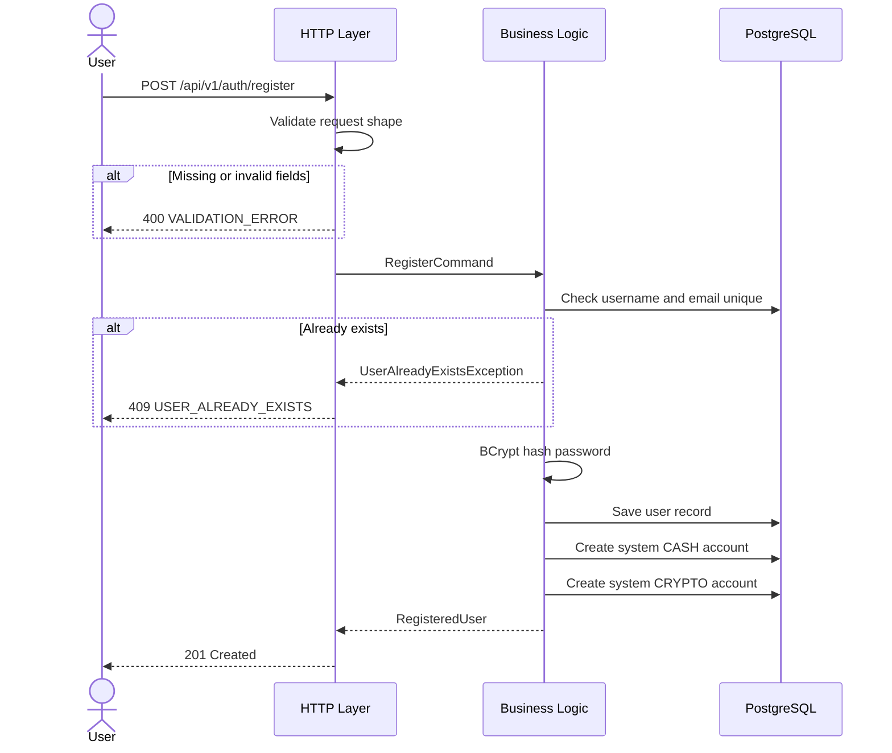
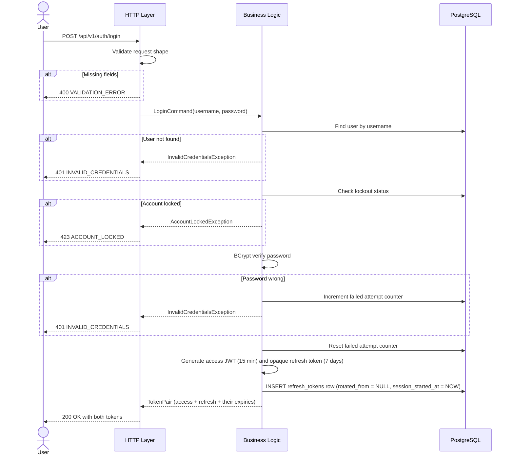
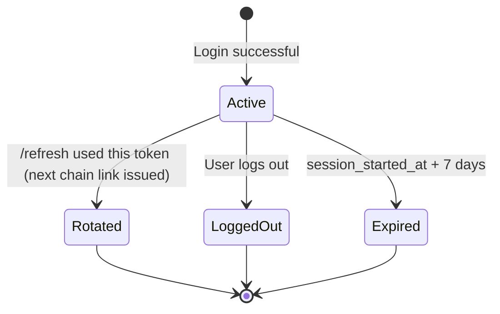
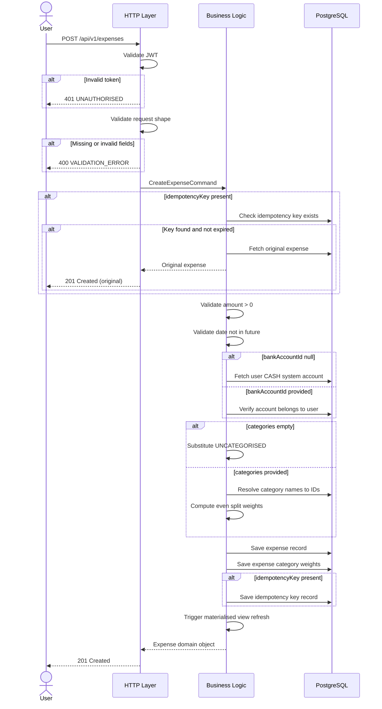
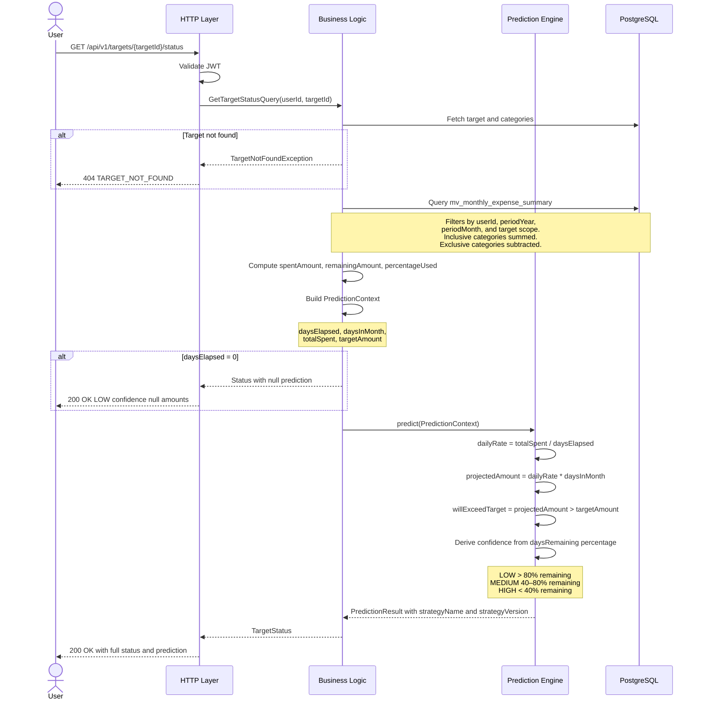

# API Contract

> **Context:** Expands [overview.md §6](../overview.md#6-how-users-interact-with-the-system). Implements: F1–F33. Decisions referenced: [ADR-0006](../decisions/0006-idempotency-key-on-expense-create.md), [ADR-0007](../decisions/0007-strategy-pattern-prediction-engine.md), [ADR-0010](../decisions/0010-no-mapper-class-yet.md), [ADR-0011](../decisions/0011-three-layer-rls-defence.md).

All endpoints live under `/api/v1`. Every authenticated endpoint requires `Authorization: Bearer <jwt>`. Standard envelope: success responses wrap data in `{ "data": ... }`. Error responses follow the `GlobalExceptionHandler` envelope.

---

## Identity and Access

### Registration

`POST /api/v1/auth/register`



**Request:**
```json
{ "username": "john_doe", "email": "john@example.com", "password": "plaintext_password" }
```

**HTTP-layer restrictions:** `username` non-blank 3–50 chars; `email` valid email format; `password` non-blank minimum 8 chars.

**Business restrictions:** Username unique; email unique; password BCrypt-hashed before storage; `emailVerified` set to `true` programmatically in v1.0 (real email verification deferred).

**Success `201 Created`:**
```json
{ "data": { "userId": "uuid", "username": "john_doe", "email": "john@example.com", "createdAt": "2026-05-08T10:00:00Z" } }
```

**Failures:** 400 `VALIDATION_ERROR`, 409 `USER_ALREADY_EXISTS`.

Implements F1, N4, N13.

---

### Login

`POST /api/v1/auth/login`



**Token lifecycle (S4):**



The access token is **not** tracked server-side — it expires naturally within 15 minutes. The refresh-token row is the single auditable record of issuance and revocation.

**Request:** `{ "username": "...", "password": "..." }`. Both non-blank.

**Business restrictions:** Username must exist; password must match BCrypt hash; account not locked.

**Success `200 OK`:** 
```json
{ "data": {
    "accessToken":             "eyJ...",
    "accessTokenExpiresAt":    "2026-05-29T10:15:00Z",
    "refreshToken":            "...",
    "refreshTokenExpiresAt":   "2026-06-05T10:00:00Z",
    "tokenType":               "Bearer"
} }
```

**Failures:** 400 `VALIDATION_ERROR`, 401 `INVALID_CREDENTIALS`, 423 `ACCOUNT_LOCKED`.

**Security:** 5 failed attempts within 10 minutes triggers 15-minute lockout. Error message never specifies whether username or password was wrong (prevents user enumeration). HTTPS enforced.

Implements F2, F4, N3, N4, N5.

---

### Refresh

`POST /api/v1/auth/refresh`

Rotates the presented refresh token: marks it `ROTATED`, issues a new access + refresh pair, copies `session_started_at` unchanged so the chain expires at the original-login-time + 7 days regardless of how many rotations have happened.

**Authentication:** the refresh token in the body authenticates the call. No `Authorization` header is required — by definition, the access token has expired when refresh is needed. RFC 6749 §6 pattern.

**Request:** `{ "refreshToken": "..." }`.

**Success `200 OK`:** Same shape as `/login`.

**Failures:**
- 400 `VALIDATION_ERROR` — missing field.
- 401 `INVALID_REFRESH_TOKEN` — unknown or expired.
- 401 `REFRESH_TOKEN_REUSE` — token has already been rotated; the entire chain is revoked as a side effect. Client must force re-login.

---

### Logout

`POST /api/v1/auth/logout`

Marks the presented refresh token as `LOGOUT` in `refresh_tokens`. The access token is **not** revoked — it expires naturally within the access-token window (≤15 min).

**Authentication:** the refresh token in the body authenticates the call (RFC 7009 pattern, adapted to JSON). No `Authorization` header is required.

**Request:** `{ "refreshToken": "..." }`.

**Idempotent + silent on stale tokens.** Logout always returns `204 No Content` regardless of the presented token's state — active, already revoked, rotated, expired, or unknown. The server only revokes the row if it's currently active (`revoked_at IS NULL`); any other state is a silent no-op.

This means a client presenting a **stale** refresh token (e.g., T28 after the chain has rotated to T29) gets a `204` but the session is *not* ended — T29 remains active. Clients must use their **most recent** refresh token to actually end a session. If a session ever appears to "not log out," the client likely has a stale token; the next `/refresh` attempt with that stale token will trigger reuse detection and surface the issue.

This matches OAuth 2.0 RFC 7009 — token revocation revokes a specific token, not a session abstraction. We do not return a distinct status for "already revoked" because that would let an attacker learn whether a stolen token was once valid (a side-channel leak). Same reason `/login` doesn't distinguish "wrong password" from "no such user."

**Failures:** 400 `VALIDATION_ERROR` (missing `refreshToken` in body). No 401 — unknown or stale refresh tokens silently return 204.

Implements F3.

---

### Get user profile

`GET /api/v1/users/me`

Returns the authenticated user's profile.

**Success `200 OK`:**
```json
{ "data": { "userId": "uuid", "username": "...", "email": "...", "isDiscoverable": false, "createdAt": "..." } }
```

Implements F5.

---

### Update profile

`PATCH /api/v1/users/me`

Only fields present in the body are updated.

**Request:** `{ "isDiscoverable": true }`

**HTTP-layer restrictions:** At least one field present; `isDiscoverable` must be boolean if present.

Implements F6.

---

### Access grants (D1)

Grants persist the "user A allows user B to act on A's data temporarily" record. **D1 ships the persistence and CRUD API only**; grants are not yet usable for actual delegation. D2 (sudo tokens) and D3 (the `asUserId` gateway filter) are required for B to actually exercise the access.

#### Create

`POST /api/v1/users/me/access-grants`

The current user (from JWT) becomes the grantor.

**Request:** `{ "granteeUsername": "...", "accessLevel": "READ_WRITE", "expiresInDays": 7 }`

- `granteeUsername` — must resolve to a user with `is_discoverable = TRUE`
- `accessLevel` — only `READ_WRITE` accepted in v2.0 (CHECK constraint reserves space for future levels)
- `expiresInDays` — 1–30 inclusive

**Success `201 Created`:** `{ "data": { "id": "...", "grantorId": "...", "grantorUsername": "...", "granteeId": "...", "granteeUsername": "...", "accessLevel": "READ_WRITE", "expiresAt": "...", "revokedAt": null } }`

**Failures:**
- 400 `VALIDATION_ERROR` — missing fields or `expiresInDays` out of range
- 404 `GRANTEE_NOT_FOUND` — unknown username OR `is_discoverable = FALSE`. Indistinguishable to prevent enumeration
- 422 `SELF_GRANT_NOT_ALLOWED` — grantor == grantee

#### List

`GET /api/v1/users/me/access-grants`

Returns every grant the user is party to — both grants given (as grantor) and grants received (as grantee). The RLS dual-clause policy on `access_grants` does the filtering. Clients can sort/group client-side by comparing each grant's `grantorId` / `granteeId` against their own user id.

**Success `200 OK`:** `{ "data": [ { ...AccessGrantResponse... }, ... ] }`

#### Revoke

`DELETE /api/v1/users/me/access-grants/{grantId}`

Soft-revoke. Sets `revoked_at = NOW()`. Allowed for either the grantor (cancelling the grant they made) or the grantee (declining the access they were given). Idempotent — re-revoking a grant is a silent 204.

**Success `204 No Content`**

**Failures:**
- 404 `GRANT_NOT_FOUND` — the grant id doesn't exist, OR the current user isn't party to it (RLS hides it; same error to prevent enumeration)

Implements F7, F8, F9, F10. F11 (sudo tokens) lands in D2; F12, F13 (gateway filter) in D3.

---

### Sudo tokens (D2)

Step-up authentication. The grantee mints a sudo token by re-entering their password; the raw token is returned once and must accompany every `?asUserId=<grantor>` request handled by D3's gateway filter. D2 ships the mint endpoint and the verify primitive (for D3); D3 plugs into verify when it lands.

#### Mint

`POST /api/v1/auth/sudo-tokens`

**Authentication:** Bearer access token required (`/api/v1/auth/sudo-tokens` is the one authenticated endpoint under `/auth/**`; the rest of `/auth/**` is `permitAll`). The body's password re-entry is the second factor on top of the JWT.

**Request:** `{ "grantId": "uuid", "password": "..." }`

**Success `201 Created`:** `{ "data": { "sudoToken": "...", "expiresAt": "..." } }` — raw token shown once; only its SHA-256 hash is persisted.

**Failures:**
- 400 `VALIDATION_ERROR` — missing fields
- 401 `INVALID_CREDENTIALS` — wrong password
- 401 `GRANT_NOT_USABLE` — grant doesn't exist, isn't the current user's, is revoked, or is expired. The four conditions are indistinguishable from the caller's perspective (enumeration defence)

#### Verify _(internal — used by D3)_

`SudoTokenService.verify(rawToken, granteeId)` returns `SudoTokenVerification(grantId, grantorId, granteeId)` if the token is valid and its underlying grant is still active. Throws `InvalidSudoTokenException` for unknown, expired, or revoked-grant tokens. Not exposed as an HTTP endpoint; called by D3's `AsUserIdFilter` directly.

Implements F11.

---

### Delegated requests (D3)

A grantee actually exercises a D1 grant by adding two things to any request on an allow-listed endpoint:

- **`?asUserId=<grantor-uuid>`** query parameter — the data owner whose context the request should operate under
- **`X-Sudo-Token: <raw>`** header — a valid D2 sudo token previously minted by the grantee against that specific grant

`AsUserIdFilter` validates both, then substitutes the request's `UserPrincipal` so the controller sees the grantor as the current user. RLS scopes data access to the grantor; the S5 audit triggers record the grantee as the actor in `created_by` / `modified_by`.

**Scope.** Only requests under `/api/v1/expenses` accept the delegation parameters in v2.0. All other endpoints (auth, profile, access-grant management, etc.) reject `?asUserId=` with a 403. Adding more endpoints to the allow-list is a deliberate future policy decision; the default is fail-closed.

**Self-delegation no-op.** A request with `?asUserId=<self>` passes through without substitution (no `X-Sudo-Token` required). Lets clients construct URLs without conditionals during development.

**Failures:**

| Status | Code | Cause |
|---|---|---|
| 400 | `VALIDATION_ERROR` | `asUserId` is not a UUID |
| 403 | `ASUSER_NOT_ALLOWED_HERE` | endpoint is outside the delegation allow-list |
| 401 | `INVALID_SUDO_TOKEN` | missing `X-Sudo-Token` header, unknown token, expired token, grant since revoked, OR sudo token's grantor doesn't match `asUserId` (single error to prevent enumeration) |
| 401 | `UNAUTHORISED` | no Bearer JWT on the request |

The four `INVALID_SUDO_TOKEN` conditions return the same status + code by design.

Implements F12, F13.

---

## Expenses and Categories

### Create manual expense

`POST /api/v1/expenses`



**Request:**
```json
{
  "idempotencyKey": "client-generated-uuid",
  "amount": 42.50,
  "merchantName": "Woolworths",
  "expenseDate": "2026-05-08",
  "categories": ["GROCERIES", "HOUSEHOLD"],
  "notes": "Weekly shop",
  "paymentMethod": "CREDIT_CARD",
  "bankAccountId": "uuid"
}
```

**HTTP-layer restrictions:** `amount` non-null numeric; `merchantName` non-blank; `expenseDate` valid date; `categories` optional (empty → UNCATEGORISED); `bankAccountId` optional (null → system CASH); `idempotencyKey` optional.

**Business restrictions:** `amount > 0`; `expenseDate` not future; categories exist; `bankAccountId` belongs to user; **category weights computed server-side as even split, never accepted from client** (see [ADR-0005](../decisions/0005-server-computed-category-weights.md)); **idempotency key returns original expense silently if matched** (see [ADR-0006](../decisions/0006-idempotency-key-on-expense-create.md)).

**Success `201 Created`:** Returns the full expense with computed `categoryWeights`.

**Failures:** 400 `VALIDATION_ERROR`, 401 `UNAUTHORISED`, 422 `INVALID_AMOUNT`, 422 `INVALID_DATE`, 422 `CATEGORY_NOT_FOUND`, 422 `BANK_ACCOUNT_NOT_FOUND`.

Implements F20, F26, F27.

---

### Get a single expense

`GET /api/v1/expenses/{expenseId}?expenseDate=...`

`expenseDate` query parameter is required — the composite PK on the partitioned table needs both id and date for lookup (see [ADR-0004](../decisions/0004-composite-pk-partitioned-expenses.md)).

**Failures:** 404 `EXPENSE_NOT_FOUND`, 401 `UNAUTHORISED`.

Implements F23.

---

### List expenses (filter + paginate)

`GET /api/v1/expenses`

| Parameter | Type | Required | Notes |
|---|---|---|---|
| `dateFrom` | date | optional | |
| `dateTo` | date | optional | |
| `merchantName` | string | optional | partial match |
| `categories` | string[] | optional | comma-separated |
| `paymentMethod` | string | optional | |
| `bankAccountId` | uuid | optional | |
| `minAmount` | decimal | optional | |
| `maxAmount` | decimal | optional | |
| `source` | string | optional | `MANUAL`, `BANK_IMPORT`, default ALL |
| `page` | int | optional | default 1 |
| `pageSize` | int | optional | default 20, max 100 |
| `sortBy` | string | optional | default `expenseDate` |
| `sortOrder` | string | optional | `ASC` or `DESC`, default `DESC` |
| `asUserId` | uuid | optional | delegation (v2.0) |

**Success `200 OK`:** `{ "data": [...], "pagination": { "page", "pageSize", "totalItems", "totalPages" } }`

**Failures:** 400 `INVALID_DATE_RANGE`, 400 `INVALID_SORT_FIELD`, 401 `UNAUTHORISED`.

**Notes.** All filters combinable and optional. All queries implicitly filter `deletedAt IS NULL`. Soft-deleted records are never visible via the API (see [ADR-0003](../decisions/0003-soft-delete-only.md)).

Implements F24.

---

### Expense summary

`GET /api/v1/expenses/summary`

| Parameter | Type | Required | Notes |
|---|---|---|---|
| `dateFrom` | date | required | |
| `dateTo` | date | required | |
| `groupBy` | string | required | `CATEGORY`, `MERCHANT`, `MONTH` |

**Success `200 OK`:**
```json
{
  "data": {
    "totalAmount": 1243.50,
    "periodFrom": "2026-05-01",
    "periodTo": "2026-05-08",
    "groups": [
      { "groupKey": "GROCERIES", "totalAmount": 423.75, "transactionCount": 8, "percentageOfTotal": 34.1 }
    ],
    "dataFreshAsOf": "2026-05-08T10:29:45Z"
  }
}
```

`dataFreshAsOf` is derived from the materialised view's last refresh timestamp. Hits materialised views, not raw expense tables.

**Failures:** 400 `VALIDATION_ERROR`, 400 `INVALID_DATE_RANGE`, 400 `INVALID_GROUP_BY`, 401 `UNAUTHORISED`.

Implements F25, N18.

---

### Update expense

`PATCH /api/v1/expenses/{expenseId}?expenseDate=...`

All fields optional — only present fields are applied.

**Business restrictions:** Bank-imported expenses (v2.0) — `amount`, `merchantName`, `expenseDate`, `paymentMethod` are immutable. Soft-deleted expenses cannot be updated. Category weights recomputed server-side if categories change.

**Failures:** 404 `EXPENSE_NOT_FOUND`, 422 `FIELD_IMMUTABLE_FOR_BANK_IMPORT`, 401 `UNAUTHORISED`.

Implements F21.

---

### Delete expense

`DELETE /api/v1/expenses/{expenseId}?expenseDate=...`

Soft delete only — sets `deletedAt` timestamp. Row never physically removed. Bank-imported expenses (v2.0) cannot be deleted.

**Success:** `204 No Content`.

**Failures:** 404 `EXPENSE_NOT_FOUND`, 422 `BANK_IMPORT_IMMUTABLE`, 401 `UNAUTHORISED`.

Implements F22, N10.

---

### Modify category

`PATCH /api/v1/categories/{categoryId}`

**Request:** `{ "name": "FOOD_AND_GROCERY", "description": "Updated description" }` — both optional.

**Business restrictions:** System categories immutable (enforced by DB trigger + application); category must belong to user; updated name must not conflict.

**Failures:** 404 `CATEGORY_NOT_FOUND`, 422 `SYSTEM_CATEGORY_IMMUTABLE`, 409 `CATEGORY_ALREADY_EXISTS`, 401 `UNAUTHORISED`.

Implements F16.

---

### Create category

`POST /api/v1/categories`

**Request:** `{ "name": "...", "description": "...", "parentId": "uuid|null" }`

Implements F15, F17.

---

### List categories

`GET /api/v1/categories`

Returns system + user's own categories. RLS policy `WHERE user_id IS NULL OR user_id = current_user_id` handles the filter automatically.

Implements F14, F19.

---

## Targets and Predictions

### Create target

`POST /api/v1/targets`

**Request:**
```json
{
  "targetType": "CATEGORY",
  "amount": 400.00,
  "periodYear": 2026,
  "periodMonth": 5,
  "categories": [
    { "categoryId": "uuid", "participation": "INCLUSIVE" }
  ]
}
```

**HTTP-layer restrictions:** `targetType` in `{CATEGORY, MULTI_CATEGORY, TOTAL}`; `amount` numeric; `periodMonth` 1–12.

**Business restrictions:** `amount > 0`; `(periodYear, periodMonth, scope)` not duplicated for active targets; `CATEGORY` type has exactly one INCLUSIVE + zero EXCLUSIVE; `TOTAL` has zero or more EXCLUSIVE + zero INCLUSIVE; `MULTI_CATEGORY` has two or more INCLUSIVE; all category IDs visible to user; period not in past.

**Failures:** 400 `VALIDATION_ERROR`, 422 `INVALID_AMOUNT`, 409 `TARGET_ALREADY_EXISTS`, 422 `INVALID_TARGET_SCOPE`, 422 `CATEGORY_NOT_FOUND`, 401 `UNAUTHORISED`.

Implements F28, F29, N15.

---

### List targets

`GET /api/v1/targets?periodYear=&periodMonth=&targetType=`

All filters optional. Returns array of target objects.

Implements F30.

---

### Target status (live progress + prediction)

`GET /api/v1/targets/{targetId}/status`



**Success `200 OK`:**
```json
{
  "data": {
    "targetId": "uuid",
    "targetAmount": 400.00,
    "spentAmount": 187.50,
    "remainingAmount": 212.50,
    "percentageUsed": 46.9,
    "prediction": {
      "projectedAmount": 468.75,
      "willExceedTarget": true,
      "projectedExceedanceAmount": 68.75,
      "strategyUsed": "NaiveDailyRate",
      "strategyVersion": "1.0",
      "confidence": "MEDIUM",
      "daysElapsed": 12,
      "daysRemainingInPeriod": 18
    },
    "dataFreshAsOf": "2026-05-08T10:29:45Z"
  }
}
```

**Failures:** 404 `TARGET_NOT_FOUND`, 401 `UNAUTHORISED`. Insufficient data returns 200 with `prediction.projectedAmount = null` and `confidence = LOW` rather than an error.

**Design notes.** `strategyUsed` + `strategyVersion` expose which algorithm ran. New versions are new strategy classes — the old ones are never modified or deleted. Historical predictions stay reproducible. See [ADR-0007](../decisions/0007-strategy-pattern-prediction-engine.md). `dataFreshAsOf` is the materialised view's refresh timestamp.

Implements F31, F32, F33.

---

### Delete target

`DELETE /api/v1/targets/{targetId}`

Soft delete only. Historical target data retained for trend analysis.

**Success:** `204 No Content`. **Failures:** 404 `TARGET_NOT_FOUND`, 401 `UNAUTHORISED`.

Implements F30.

---

## Error envelope

All error responses share a uniform shape produced by `GlobalExceptionHandler`:

```json
{
  "code": "USER_ALREADY_EXISTS",
  "message": "Username or email is already taken",
  "traceId": "uuid"
}
```

`code` is a stable string suitable for client switch logic. `message` is human-readable and may change. `traceId` allows correlation with server logs.

> **Note:** `traceId` is currently a fresh UUID generated per error response. Real distributed-trace correlation (propagating a header through the call chain) is a v1.1 task.
