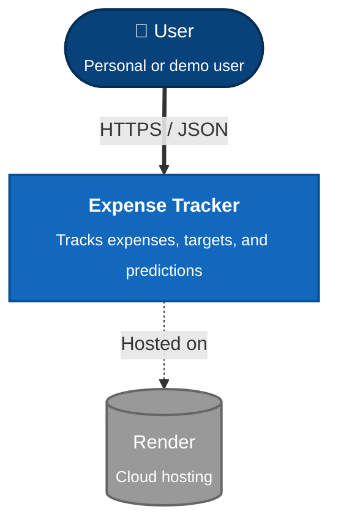
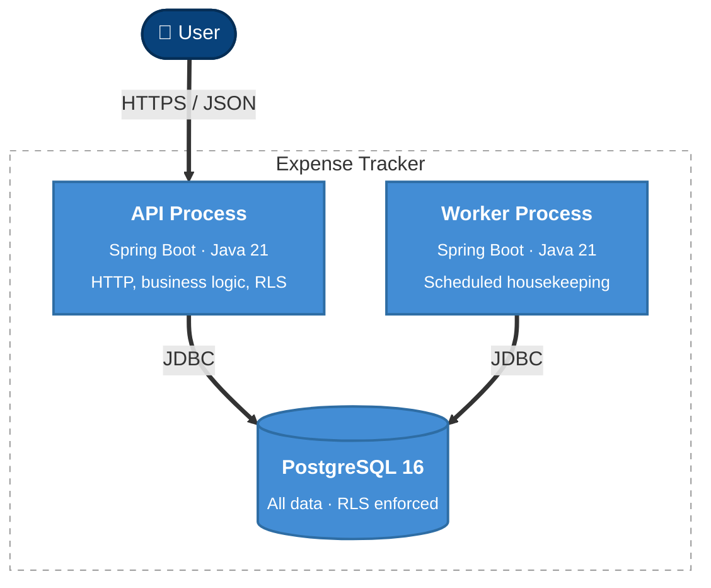
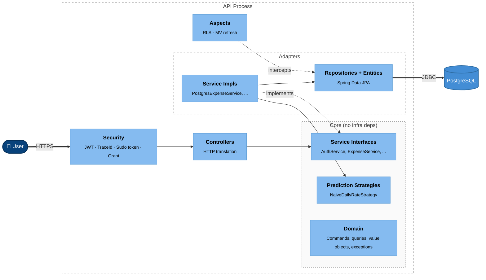
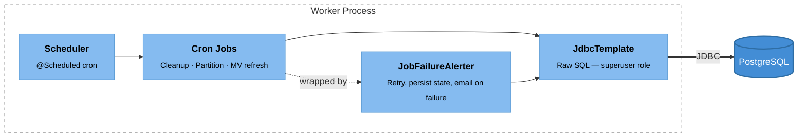

# C4 Architecture Diagrams

> **Context:** Expands [overview.md §4](../overview.md#4-the-shape-of-the-system). For dependency rules and Gradle module structure see [module-boundaries.md](module-boundaries.md). For schema, see [data-model.md](data-model.md). Implements: N1, N2.

Three levels of zoom — System Context, Container, and Component. Each level answers a different question. Read top-down: the higher levels frame the lower ones.

---

## Level 1 — System Context

**Question:** Who uses the system and what does it depend on?

One user actor, one system, one hosting platform. No external integrations in v1.0 — Basiq (bank data, including its hosted consent UI for per-user enrolment) appears at this level only when v2.0 brings it in. The app-level Basiq API key sits in env config; v3.0 may migrate it to Bitwarden Secrets Manager (ADR-0019).

---

## Level 2 — Container

**Question:** What deployable processes make up the system, and how do they communicate?

Three containers. API and Worker communicate exclusively through the database — no HTTP between them.

---

## Level 3 — API Process Components

**Question:** What lives inside the API process and how do the pieces fit together?

**Key things visible.** Security is the entry point — every request passes through it. Controllers depend on service *interfaces* in core; the concrete implementations and the JPA repositories live in adapters. Aspects sit outside the main flow and intercept repositories: one for RLS session injection, one for materialised view refresh (planned). Core has no infrastructure dependencies — ArchUnit tests enforce this at build time.

---

## Level 3 — Worker Process Components

**Question:** What lives inside the Worker process and how does it differ from the API?

**Key things visible.** The Worker is headless — no HTTP, no security filter, no JPA. Cron jobs hold their own SQL and talk directly to PostgreSQL via `JdbcTemplate` using superuser credentials (which bypass RLS — see [module-boundaries.md](module-boundaries.md)). Every job is wrapped by `JobFailureAlerter`, which retries on failure, persists state in `job_execution_state`, and emails a configured recipient when all attempts fail. The Worker depends only on `core`; it does *not* link the JPA adapter implementations.
