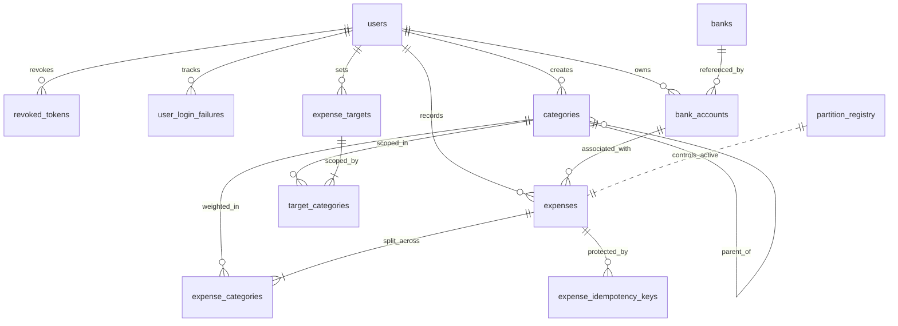

# Data Model

> **Context:** Expands [overview.md §5](../overview.md#5-the-data-the-system-holds). Implements: F1–F6, F14–F27, F34–F37, N1, N2, N4, N9–N18. Decisions referenced: [ADR-0002](../decisions/0002-postgres-for-rls-skip-locked-mvs.md), [ADR-0003](../decisions/0003-soft-delete-only.md), [ADR-0004](../decisions/0004-composite-pk-partitioned-expenses.md), [ADR-0005](../decisions/0005-server-computed-category-weights.md), [ADR-0012](../decisions/0012-system-categories-via-null-user-id.md), [ADR-0013](../decisions/0013-yearly-expense-partitions.md), [ADR-0014](../decisions/0014-materialised-view-wrapper-for-rls.md).

Twelve tables, two materialised views, one partition registry. Schema is grouped by business category.

---

## Cross-cutting conventions

These apply to every table without restatement.

**Primary keys.** All application-generated UUIDs. Avoids sequential ID enumeration attacks and works correctly across distributed systems.

**Money.** All `NUMERIC(12,2)`. Never floating point — floating point arithmetic on money is a correctness bug.

**Timestamps.** All `TIMESTAMPTZ` stored in UTC. Display conversion is the client's responsibility.

**Audit columns.** Every table has `created_at`, `updated_at`, `created_by`, `modified_by`. `created_*` are never updatable. `modified_*` update automatically via DB trigger on every UPDATE.

**Timestamp ownership rule:**

- `created_at` — set by `DEFAULT NOW()` on insert. A DB trigger (`lock_created_at`) prevents any update. Hibernate maps it with `updatable = false` as a second layer of defence.
- `updated_at` — set by `DEFAULT NOW()` on insert. A DB trigger (`set_updated_at`) overwrites it on every update automatically. Hibernate maps it with `insertable = false, updatable = false` — Java never touches this field. Accurate even if someone bypasses the application and runs SQL directly.

**Soft deletes.** `deleted_at TIMESTAMPTZ NULL`. NULL means active. Physical deletion never happens. See [ADR-0003](../decisions/0003-soft-delete-only.md).

**Row Level Security.** RLS enabled on every tenant-scoped table. Every query is rewritten by PostgreSQL to add `WHERE user_id = current_setting('app.current_user_id')::uuid`. RESTRICTIVE mode — if the session variable is missing, queries return zero rows.

---

## Auth module

### `users`

The root identity record. Kept intentionally minimal — only what auth needs.

```
id                  UUID            PRIMARY KEY
username            VARCHAR(50)     NOT NULL UNIQUE          (3–50 chars enforced)
email               VARCHAR(255)    NOT NULL UNIQUE          (format check constraint)
password            VARCHAR(255)    NOT NULL                 (BCrypt hash, never plaintext)
is_discoverable     BOOLEAN         NOT NULL DEFAULT FALSE   (opt-in for being granted access)
locked_until        TIMESTAMPTZ     NULL                     (set when 5 failures within 10min hit, cleared on success or expiry)
```

Maps to F1, F2, F4, F5, F6, F8, N4, N13.

### `user_login_failures`

Records every failed login attempt. The sliding-window count over the last 10 minutes drives the 15-minute lockout written to `users.locked_until`. Rows are retained for 30 days for forensic value and purged by the nightly cleanup job.

```
id              UUID         PRIMARY KEY DEFAULT gen_random_uuid()
user_id         UUID         NOT NULL REFERENCES users(id) ON DELETE CASCADE
attempted_at    TIMESTAMPTZ  NOT NULL DEFAULT NOW()
ip_address      INET         NULL                              (reserved; not populated in v1.1)
```

Indexes:
- `idx_user_login_failures_user_at` on `(user_id, attempted_at DESC)` — supports the sliding-window `COUNT(*)` and the cleanup scan.

Maps to F4.

### `revoked_tokens`

Stores the `jti` (JWT ID) of tokens that have been explicitly revoked via logout. The auth filter checks this table on every request — if the `jti` appears here, the token is rejected even if it has not expired.

```
token_jti   UUID        PRIMARY KEY                          (JWT ID from logged-out token)
user_id     UUID        NOT NULL REFERENCES users(id)
revoked_at  TIMESTAMPTZ NOT NULL DEFAULT NOW()
expires_at  TIMESTAMPTZ NOT NULL                             (cleanup trigger)
```

Indexes:
- `idx_revoked_tokens_jti` — fast lookup on every authenticated request
- `idx_revoked_tokens_expires` — cleanup job deletes rows where `expires_at <= NOW()`

Compromise of this table reveals identifiers, not valid tokens. Maps to F3, F36, N5.

### `sudo_tokens` (deferred to v2.0)

```
token_hash       VARCHAR(64) PRIMARY KEY                     (SHA-256 hex of the raw token)
grantor_id       UUID        NOT NULL REFERENCES users(id)
grantee_id       UUID        NOT NULL REFERENCES users(id)
expires_at       TIMESTAMPTZ NOT NULL
```

**Lifecycle:** User triggers sudo token creation. Server generates a cryptographically secure random 32-byte token, computes SHA-256 hash, stores the hash with grantor/grantee/expiry, returns the raw token to the user once. The raw token is never stored. On every delegation request, the gateway filter hashes the incoming token and looks it up.

**Why SHA-256 not BCrypt.** Sudo tokens are 256-bit random values — brute force is computationally infeasible regardless of hash speed. BCrypt would add latency to every delegation request for no security benefit. Maps to F7, F11, N10.

---

## Reference data

### `banks`

```
id          UUID         PRIMARY KEY
name        VARCHAR(255) NOT NULL
abn         VARCHAR(11)  NOT NULL UNIQUE                     (CHECK LENGTH = 11 AND abn ~ '^[0-9]+$')
```

Public reference data. No RLS — all authenticated users read the same list. Populated via Flyway seed scripts with major Australian banks (CBA, ANZ, NAB, Westpac, Macquarie, Bendigo, ING, ME Bank). Same seed runs in personal and demo deployments. Maps to F20.

### `bank_accounts`

```
id              UUID        PRIMARY KEY
user_id         UUID        NOT NULL REFERENCES users(id)
bank_id         UUID        NULL REFERENCES banks(id)
name            VARCHAR(50) NOT NULL
account_type    VARCHAR(20) NOT NULL                          (CHECK IN ('CASH', 'CRYPTO', 'BANK'))
is_system       BOOLEAN     NOT NULL DEFAULT FALSE
CHECK ((account_type = 'BANK' AND bank_id IS NOT NULL)
    OR (account_type != 'BANK' AND bank_id IS NULL))
UNIQUE (user_id, name)
```

RLS enforced via `user_id`. CASH and CRYPTO system accounts are created at registration for every user (application code). Real bank accounts are seeded via Flyway for known personal users only — demo deployment seeds none. Achieved by separating Flyway migration locations per deployment environment. Maps to F20, N10.

---

## Expense module

### `categories`

```
id           UUID         PRIMARY KEY
user_id      UUID         NULL REFERENCES users(id)
name         VARCHAR(50)  NOT NULL
description  VARCHAR(255) NULL
parent_id    UUID         NULL REFERENCES categories(id)
```

`user_id IS NULL` means a system category. `user_id NOT NULL` means a private user category. No separate `is_system` column — it would be redundant and risks inconsistency. See [ADR-0012](../decisions/0012-system-categories-via-null-user-id.md).

**RLS policy:**
```sql
CREATE POLICY category_isolation ON categories
USING (user_id IS NULL
    OR user_id = current_setting('app.current_user_id')::uuid);
```

**Uniqueness — partial indexes:**
```sql
CREATE UNIQUE INDEX uq_system_category_name
ON categories (name)
WHERE user_id IS NULL;

CREATE UNIQUE INDEX uq_user_category_name
ON categories (user_id, name)
WHERE user_id IS NOT NULL;
```

System-wide names are unique. User-scoped names are unique per user. User A and User B can both have a "PETROL" — they do not conflict with each other or with the system version.

System category descriptions follow the format `"System generated - <NAME>"`. Set in the Flyway seed script.

**Parent-Child rule.** System categories cannot have user categories as parents (would expose private data via the hierarchy). The reverse is allowed. Enforced by application-layer validation in v1.0.

**Population in v1.0.** Flyway seeds useful system categories at DB startup — UNCATEGORISED, GROCERIES, DINING, TRANSPORT, UTILITIES, RENT, ENTERTAINMENT, HEALTHCARE. Users create their own categories via the existing `POST /api/v1/categories` endpoint. No promotion mechanism in v1.0.

Maps to F14, F15, F17, F19, N10, N14.

### `expenses`

```sql
CREATE TABLE expenses (
    id              UUID        NOT NULL,
    user_id         UUID        NOT NULL REFERENCES users(id),
    amount          NUMERIC(12,2) NOT NULL CHECK (amount > 0),
    merchant_name   VARCHAR(255) NOT NULL,
    expense_date    DATE        NOT NULL CHECK (expense_date <= CURRENT_DATE),
    payment_method  VARCHAR(20) NOT NULL CHECK (payment_method IN
                      ('CASH', 'CREDIT_CARD', 'DEBIT_CARD', 'BANK_TRANSFER', 'OTHER')),
    bank_account_id UUID        NOT NULL REFERENCES bank_accounts(id),
    notes           TEXT        NULL,
    source          VARCHAR(20) NOT NULL DEFAULT 'MANUAL'
                      CHECK (source IN ('MANUAL', 'BANK_IMPORT')),
    deleted_at      TIMESTAMPTZ NULL,
    PRIMARY KEY (id, expense_date)
) PARTITION BY RANGE (expense_date);
```

**Partitioning.** Yearly partitions. The `partition_registry` table tracks which years exist and their status. The worker creates next year's partition every December and archives the oldest year every January. Active partitions cover 5 years. See [ADR-0013](../decisions/0013-yearly-expense-partitions.md).

**Composite primary key.** `(id, expense_date)` — required by PostgreSQL when partitioning on `expense_date`. This is why single-expense lookups require both `id` and `date` as parameters in the API. See [ADR-0004](../decisions/0004-composite-pk-partitioned-expenses.md).

**Deferred to v2.0.** `fingerprint` for soft deduplication, `external_transaction_id` for Basiq, `bank_status` for pending vs settled, `merged_from` for duplicate-resolution audit, `ai_categorised` for AI categorisation. Added via migration when needed.

Maps to F20, F21, F22, F23, F24, F26, N9, N10, N11, N12.

### `expense_categories`

```sql
CREATE TABLE expense_categories (
    expense_id      UUID          NOT NULL,
    expense_date    DATE          NOT NULL,
    category_id     UUID          NOT NULL REFERENCES categories(id),
    user_id         UUID          NOT NULL REFERENCES users(id),
    weight_amount   NUMERIC(12,2) NOT NULL CHECK (weight_amount > 0),
    PRIMARY KEY (expense_id, expense_date, category_id),
    FOREIGN KEY (expense_id, expense_date) REFERENCES expenses(id, expense_date)
);
```

`expense_id` and `expense_date` together reference the parent expense — the composite FK is required because the expenses table primary key is composite due to partitioning.

`user_id` denormalised from the expense for RLS efficiency. Safe to denormalise because expense ownership never changes after creation.

`weight_amount` stores the pre-computed even split at write time. A $100 expense across 4 categories stores 4 rows with $25 each. Eliminates recomputation on every aggregation query. See [ADR-0005](../decisions/0005-server-computed-category-weights.md).

Maps to F19, F20, F26, N10.

### `expense_idempotency_keys`

```sql
CREATE TABLE expense_idempotency_keys (
    user_id          UUID         NOT NULL REFERENCES users(id),
    idempotency_key  VARCHAR(255) NOT NULL,
    expense_id       UUID         NOT NULL,
    expense_date     DATE         NOT NULL,
    expires_at       TIMESTAMPTZ  NOT NULL DEFAULT (NOW() + INTERVAL '24 hours'),
    PRIMARY KEY (user_id, idempotency_key),
    FOREIGN KEY (expense_id, expense_date) REFERENCES expenses(id, expense_date)
);
```

The composite PK `(user_id, idempotency_key)` scopes keys per user — the same client-generated UUID from two different users does not conflict.

`expense_id` + `expense_date` link to the original expense so the server can return it on a duplicate request rather than rejecting.

`expires_at` defaults to 24 hours — standard industry retry window. Cleanup job removes expired rows nightly. Idempotency keys are not credentials — storing in plaintext is fine.

Maps to F27, F36, N10.

---

## Target module

### `expense_targets`

```sql
CREATE TABLE expense_targets (
    id           UUID          PRIMARY KEY,
    user_id      UUID          NOT NULL REFERENCES users(id),
    target_type  VARCHAR(20)   NOT NULL CHECK (target_type IN ('CATEGORY', 'MULTI_CATEGORY', 'TOTAL')),
    amount       NUMERIC(12,2) NOT NULL CHECK (amount > 0),
    period_year  INTEGER       NOT NULL,
    period_month INTEGER       NOT NULL CHECK (period_month BETWEEN 1 AND 12),
    deleted_at   TIMESTAMPTZ   NULL
);
```

Soft delete only — historical target data is retained for future trend analysis.

`period_year` and `period_month` as separate fields match the API contract and are easier to query than parsing a date.

Maps to F28, F30, F31, N10, N15.

### `target_categories`

```sql
CREATE TABLE target_categories (
    target_id           UUID         NOT NULL REFERENCES expense_targets(id),
    category_id         UUID         NOT NULL REFERENCES categories(id),
    user_id             UUID         NOT NULL REFERENCES users(id),
    participation_type  VARCHAR(20)  NOT NULL DEFAULT 'INCLUSIVE'
                          CHECK (participation_type IN ('INCLUSIVE', 'EXCLUSIVE')),
    PRIMARY KEY (target_id, category_id)
);
```

**Why split into two tables.** A target has one amount and one period. Its scope can span one or many categories with inclusive or exclusive participation. Separating scope into a junction handles all three target types — `CATEGORY`, `MULTI_CATEGORY`, `TOTAL` — through one unified mechanism.

- `CATEGORY` target → one junction row with `INCLUSIVE`
- `MULTI_CATEGORY` target → multiple `INCLUSIVE` rows
- `TOTAL` target → zero or more `EXCLUSIVE` rows

The application enforces which combinations are valid per type.

**Uniqueness for active target per period and scope.** Deferred to application layer in v1.0. Two active targets for the same scope and period are technically allowed by the schema but the application prevents creation. Adequate at this scale.

Maps to F28, F29, F30, F31, N10, N15.

---

## Worker state

### `job_execution_state`

Tracks scheduled-job runs so retry state survives a worker restart and the alerter can detect crashed ticks on the next firing. One row per job name. Written by `JobFailureAlerter` in a `REQUIRES_NEW` transaction so the row commits even when the wrapped job's transaction rolls back.

```sql
CREATE TABLE job_execution_state (
    job_name       TEXT        PRIMARY KEY,
    status         TEXT        NOT NULL CHECK (status IN ('RUNNING', 'SUCCESS', 'ALERTED')),
    attempt_count  INT         NOT NULL DEFAULT 0,
    last_error     TEXT,
    created_at     TIMESTAMPTZ NOT NULL DEFAULT NOW(),
    updated_at     TIMESTAMPTZ NOT NULL DEFAULT NOW()
);
```

System-wide infrastructure shared across all jobs — no RLS. The CHECK constraint mirrors the `JobExecutionStatus` enum in `worker/.../alert/JobExecutionStatus.java`; adding a new status requires both an enum value and a migration that drops and recreates the constraint.

**Lifecycle per tick:**
1. Tick fires → row upserted with `status = RUNNING`, `attempt_count = 0`.
2. Each retry updates `attempt_count`; on success → `status = SUCCESS`.
3. After all five attempts fail → `status = ALERTED`, `last_error` set, email sent.
4. **Crash recovery:** if the next tick sees `status = RUNNING` and `updated_at < NOW() - 15 minutes`, it resumes from `attempt_count + 1` rather than restarting.

The nightly `cleanupJobExecutionState` job (02:15 UTC) prunes `SUCCESS` rows older than 1 day and `ALERTED` rows older than 7 days. Retention bounds the table without losing recent history. Full failure semantics in [../operations/scheduled-jobs.md](../operations/scheduled-jobs.md).

---

## Partition registry

### `partition_registry`

```sql
CREATE TABLE partition_registry (
    partition_year SMALLINT     PRIMARY KEY,
    status         VARCHAR(10)  NOT NULL CHECK (status IN ('ACTIVE', 'ARCHIVED'))
);
```

System-wide infrastructure shared across all users — no RLS. All users share the same partitioning state.

**Population.** Flyway seeds the current year at first deployment and creates the corresponding PostgreSQL partition. Worker's December cron job inserts next year's row and creates the partition. Worker's January cron job updates the oldest row to `ARCHIVED`.

**Partition naming.** Deterministic — `expenses_<year>`. The worker constructs names from the year. No need to store the name as a column.

**How materialised views use it.** Views join on `partition_registry WHERE status = 'ACTIVE'` so archived partitions are excluded automatically. Changing partition status changes view results without modifying the view definition.

Maps to F34, F35, N11, N12.

---

## Materialised views

### `mv_monthly_expense_summary`

```sql
CREATE MATERIALIZED VIEW mv_monthly_expense_summary AS
SELECT
    ec.user_id,
    EXTRACT(YEAR FROM e.expense_date)::SMALLINT  AS period_year,
    EXTRACT(MONTH FROM e.expense_date)::SMALLINT AS period_month,
    ec.category_id,
    SUM(ec.weight_amount)                         AS total_amount,
    COUNT(DISTINCT e.id)                          AS transaction_count
FROM expense_categories ec
JOIN expenses e
    ON e.id = ec.expense_id
    AND e.expense_date = ec.expense_date
JOIN partition_registry pr
    ON EXTRACT(YEAR FROM e.expense_date)::SMALLINT = pr.partition_year
WHERE e.deleted_at IS NULL
  AND pr.status = 'ACTIVE'
GROUP BY ec.user_id, period_year, period_month, ec.category_id;

CREATE UNIQUE INDEX uq_mv_monthly_expense_summary
ON mv_monthly_expense_summary (user_id, period_year, period_month, category_id);

CREATE VIEW v_monthly_expense_summary AS
SELECT * FROM mv_monthly_expense_summary
WHERE user_id = current_setting('app.current_user_id')::uuid;
```

### `mv_merchant_summary`

```sql
CREATE MATERIALIZED VIEW mv_merchant_summary AS
SELECT
    e.user_id,
    EXTRACT(YEAR FROM e.expense_date)::SMALLINT  AS period_year,
    EXTRACT(MONTH FROM e.expense_date)::SMALLINT AS period_month,
    e.merchant_name,
    SUM(e.amount)                                 AS total_amount,
    COUNT(*)                                      AS transaction_count
FROM expenses e
JOIN partition_registry pr
    ON EXTRACT(YEAR FROM e.expense_date)::SMALLINT = pr.partition_year
WHERE e.deleted_at IS NULL
  AND pr.status = 'ACTIVE'
GROUP BY e.user_id, period_year, period_month, e.merchant_name;

CREATE UNIQUE INDEX uq_mv_merchant_summary
ON mv_merchant_summary (user_id, period_year, period_month, merchant_name);

CREATE VIEW v_merchant_summary AS
SELECT * FROM mv_merchant_summary
WHERE user_id = current_setting('app.current_user_id')::uuid;
```

**Why two views.** Category aggregation uses `expense_categories.weight_amount` because expenses split across categories. Merchant aggregation uses `expenses.amount` directly because each expense has one merchant. The structure of the underlying data dictates the view shape.

**Why the unique index.** `REFRESH MATERIALIZED VIEW CONCURRENTLY` requires it. Concurrent refresh does not block reads — the unique index is what makes that possible. Direct consequence of [ADR-0008](../decisions/0008-aop-materialised-view-refresh.md).

**Why the wrapper views.** PostgreSQL RLS policies do not apply to materialised views directly. The wrapper regular view applies the session-variable filter. The application always queries the wrapper (`v_`), inheriting the same RLS enforcement model used across the rest of the schema. See [ADR-0014](../decisions/0014-materialised-view-wrapper-for-rls.md).

**Joining on partition_registry.** The views only include rows from active partitions. Archived partition data is excluded automatically without changing the view definition. When a partition is archived, its data disappears from the next refresh.

Maps to F25, F31, F37, N16, N17, N18.

---

## ERD overview


