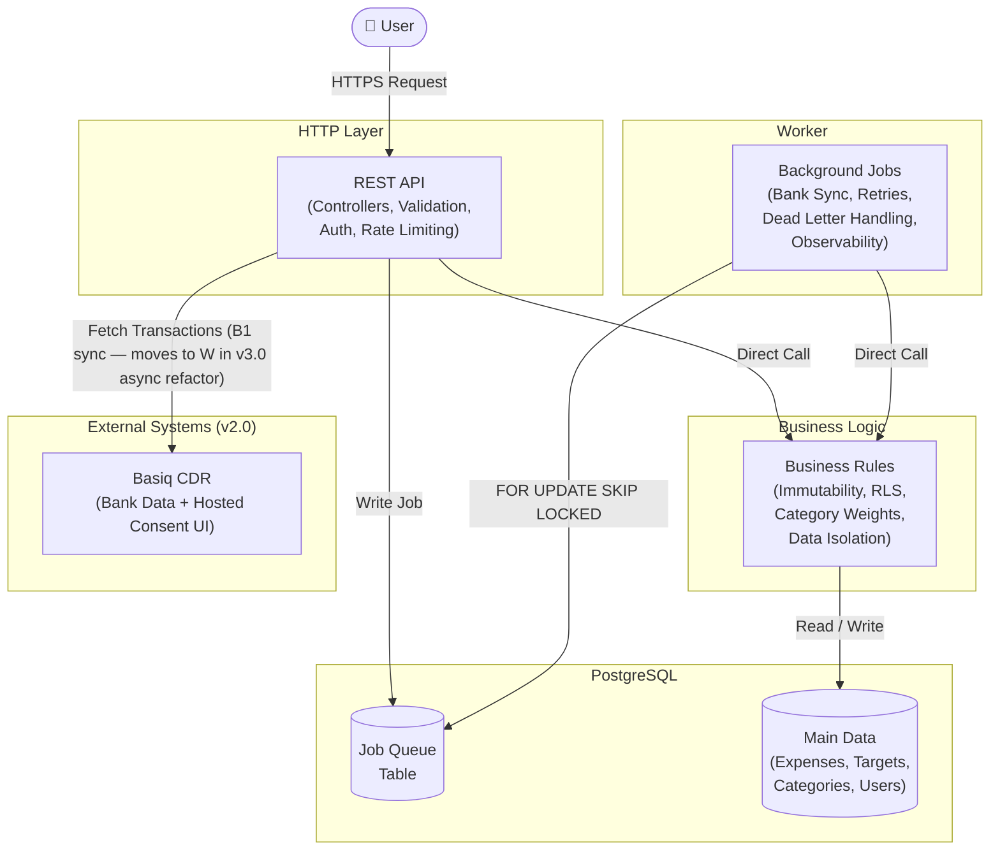

# Module Boundaries

> **Context:** Expands [overview.md §3](../overview.md#3-architectural-implications) and [overview.md §4](../overview.md#4-the-shape-of-the-system). Decisions referenced: [ADR-0001](../decisions/0001-three-package-split.md), [ADR-0010](../decisions/0010-no-mapper-class-yet.md). Implements: N1.

The codebase is split into four packages — `core`, `adapters`, `api`, `worker`. The split is enforced at compile time by Gradle module dependencies. A boundary violation fails the build.

---

## Why the split exists

The separation is not about current scale. It is about the nature of the responsibilities.

**The business logic package is the core.** It is what every future extension — bank integration, AI categorisation, prediction model upgrades — will build on top of. If business logic is tangled with HTTP handling or worker infrastructure, extending it means touching code that has nothing to do with the extension. Keeping it isolated means new capabilities can be added without touching existing ones.

**The HTTP layer package is about usability.** If the interface needs to change — a proper UI, a mobile client, a different API version — that change should be contained here. It should never require touching business logic or worker infrastructure.

**The worker package is about system behaviour and observability.** Bank sync, retries, background processing, and eventually performance monitoring and external integrations live here. These have completely different operational characteristics to a user-facing API. They need to be monitored, scaled, and extended independently.

Two functions with completely different responsibilities belong in different packages. This is a deliberate design principle that makes the system extensible without making it fragile.

---

## Dependency rules

Dependencies point inward toward the domain, never outward toward infrastructure. The compiler enforces this — Gradle module dependencies are unidirectional.

```
core/      ←  no dependencies on adapters, api, or worker
adapters/  ←  depends on core
api/       ←  depends on adapters (and transitively on core)
worker/    ←  depends on core only — talks to PostgreSQL via raw JdbcTemplate,
              does not link the JPA adapter implementations
```

Domain interfaces in `core` never import Spring annotations, JDBC, or HTTP clients. Adapters in `adapters` implement port interfaces from `core` using infrastructure-specific libraries. `api` depends on `core` and `adapters`; `worker` depends on `core` only (it talks to the database via raw JDBC and does not link the JPA adapter implementations).

The boundary is *not* a pure hexagonal split — Spring Boot and Java are taken as givens, so the HTTP layer and HTTP-facing concerns (filters, controllers, `GlobalExceptionHandler`, `SecurityConfig`) live directly in `api` rather than behind adapter interfaces. Only things that could realistically be swapped (database, ORM) sit behind the adapter boundary.

Some Spring-coupled classes live in `adapters` rather than `api` because they're consumed by adapter services. `DataSourceConfig`, `JwtProperties`, `JwtService`, and `SecureTokenGenerator` are imported by `PostgresAuthService` and `PostgresSudoTokenService` — and since `adapters` cannot depend on `api` (it would create a cycle), the classes have to live in the lower module. `com.finance.security` and `com.finance.config` end up as split packages spanning both modules. That's mildly unusual but is the lowest-churn way to keep the dependency graph acyclic.

---

## Package layout

```
core/
├── command/        request value objects sent into services
├── domain/         pure data carriers — UserProfile, Expense, Target, PredictionResult, ...
├── exception/      domain exception classes (CategoryNotFoundException, ...)
├── prediction/     pure algorithmic strategies (NaiveDailyRateStrategy)
├── query/          query value objects (ExpenseQuery, SummaryQuery, ...)
└── service/        port interfaces — AuthService, ExpenseService, ...

adapters/
├── entity/         JPA entities
├── repository/     Spring Data JPA repositories
├── service/impl/   Service implementations (PostgresExpenseService, ...)
├── config/         Spring config consumed by adapters' services (DataSourceConfig, JwtProperties, BasiqProperties)
├── security/       Pure-crypto building blocks used by adapter services (JwtService, SecureTokenGenerator)
└── resources/db/migration/   Flyway SQL migrations

api/
├── ApiApplication.java        @SpringBootApplication entry point
├── controller/                HTTP translation, command building
├── dto/                       request / response shapes
├── security/                  HTTP-facing filters and aspects (JwtAuthenticationFilter, AsUserIdFilter, RlsSessionAspect, TraceIdFilter, JwtAuthenticationEntryPoint)
├── config/                    HTTP-facing config (SecurityConfig, OpenApiConfig, ClockConfig)
└── exception/                 GlobalExceptionHandler (the only Spring-coupled exception class)

worker/
├── WorkerApplication.java     @SpringBootApplication entry point
├── alert/                     JobFailureAlerter, JobExecutionStatus
├── config/                    ClockConfig, WorkerConfig
└── job/                       CleanupJob, MaterializedViewRefreshJob, PartitionMaintenanceJob
```

ArchUnit tests in `api/src/test/java/com/finance/architecture/ArchitectureTest.java` enforce the rules the Gradle layout cannot express on its own — no Spring on `core` packages, `@RestController` only in `com.finance.controller`, `@Entity` only in `com.finance.entity`.

---

## Module ownership rules

**Each module owns its tables exclusively.** No module queries another module's tables directly. All cross-module access is via published service interfaces in `core`.

**Key ownership decisions:**

- Expense module owns category weight computation — callers send category list, module computes even split. Driven by F26, ADR-0005.
- Target module reads only from materialised views via `ExpenseService.getSummary`, never raw expense tables. Driven by F31, N18.
- Bank worker (v2.0) calls `ExpenseService.importBankTransaction` through the interface — never writes to `expenses` directly.
- AI worker (v2.0) calls `ExpenseService.applyCategorisationSuggestion` through the interface — conflict detection lives inside Expense module, not AI module.
- Archival module (v2.0) touches only `partition_registry` — never reads expense records.
- `UserPrincipal` injected by the gateway filter — no module calls `AuthService` during a live request.

---

## HTTP layer responsibilities

The HTTP layer is intentionally thin. Each controller has one job: translate HTTP into a service call, and translate the result back into HTTP. The full chain:

```
HTTP request
    → @RequestBody / @RequestParam / @PathVariable  (deserialisation)
    → DTO  (validated via @Valid + Jakarta Bean Validation)
    → Command  (sent to service)
    → Domain object  (returned from service)
    → Response DTO  (serialised back to JSON)
HTTP response
```

The gateway filter (`JwtAuthenticationFilter`) runs on every request in this sequence:

1. Validate JWT (signature, expiry, not in revoked-tokens table)
2. Populate `SecurityContext` with `UserPrincipal`
3. `[v2.0]` Sudo token and grant check if `asUserId` is present

Three distinct failure responses:
- **401** for invalid JWT
- **401 with `SUDO_TOKEN_REQUIRED`** for missing sudo token (v2.0)
- **403** for invalid grant (v2.0)

Request validation is structural only — required fields present, correct types, date format valid. Business validation happens in the service layer. Why no separate mapper or factory class is used today is in [ADR-0010](../decisions/0010-no-mapper-class-yet.md).

---

## Worker layer responsibilities

The Worker owns one mechanism in v1.0: **a cron scheduler** for partition management, nightly cleanup, and materialised view refresh. **A job queue consumer** is designed for v2.0 (B3) and arrives with the normalisation worker — no `jobs` table or pulling loop exists in v1.0.

**Nightly cleanup jobs (02:00 – 02:15 UTC)** — expired revoked tokens, expired idempotency keys, login failures older than 30 days, and finished `job_execution_state` rows (SUCCESS >1 day, ALERTED >7 days).

**Annual partition jobs** — December 1 creates next year's `expenses_<year>` partition, January 1 detaches partitions older than five years.

**Materialised view refresh (02:30 UTC)** — `REFRESH MATERIALIZED VIEW CONCURRENTLY` for both summary views.

**Failure handling.** Every job runs through `JobFailureAlerter`, which retries up to five times per tick with exponential backoff (30s → 60s → 120s → 240s), persists state in `job_execution_state`, recovers from a crashed tick on the next scheduled run, and emails the configured recipient if all attempts fail. Details in [../operations/scheduled-jobs.md](../operations/scheduled-jobs.md).

---

## System-level component diagram



The app-level Basiq API key lives in env config (`.env` / Render secret env vars). v3.0 may migrate it to Bitwarden Secrets Manager via REST — see ADR-0019.
