# Getting Started

## Prerequisites

| Tool | Version | Why |
|---|---|---|
| **JDK** | 21 | Project's Gradle toolchain target |
| **Docker** | any recent | Runs PostgreSQL (and MailHog for local dev) via `docker-compose` |
| **Gradle** | 8.9 (bundled wrapper) | Build + run; just use `./gradlew` — don't install separately |
| **curl** (or any HTTP client) | any | For hitting the API in the walkthrough below; Swagger UI works just as well |
| **jq** | optional | Makes the walkthrough's `$ACCESS_TOKEN=$(... | jq -r ...)` patterns work |

If you don't have JDK 21: install via [SDKMAN](https://sdkman.io/) (`sdk install java 21-tem`) or [Homebrew](https://brew.sh/) (`brew install openjdk@21`). Gradle's toolchain feature can also auto-provision JDK 21 via Foojay if your `~/.gradle/init.gradle` enables the resolver plugin — but the explicit install is the most reliable path.

## Setup

```bash
# 1. Clone (or you already have the repo)
git clone <your-fork-url> expense-tracker
cd expense-tracker

# 2. Copy the env template and fill in real values
cp .env.example .env
# Edit .env:
#   - Generate a JWT_SECRET with: openssl rand -hex 32
#   - Set DB passwords (any value; the init-db script picks them up)

# 3. Start Postgres + MailHog
docker compose up -d

# Verify Postgres is healthy
docker compose ps
docker exec expense-tracker-db psql -U postgres -d expense_db -c "\du"

# 4. Run the API (it runs Flyway migrations at startup)
./gradlew :api:bootRun

# In a separate terminal: run the worker (cron jobs)
./gradlew :worker:bootRun
```

The API listens on **`http://localhost:8080`** by default. The worker has no HTTP server.

## Verify

| What | URL / Command |
|---|---|
| Swagger UI (interactive API explorer) | http://localhost:8080/swagger-ui.html |
| OpenAPI JSON | http://localhost:8080/api-docs |
| Health check | `curl http://localhost:8080/actuator/health` |
| MailHog (for v1.1 #4 job-failure email alerts in dev) | http://localhost:8025 |
| Postgres role check | `docker exec -it expense-tracker-db psql -U postgres -d expense_db -c "\du"` |

If the API logs show `Flyway: Successfully applied N migrations` and Swagger UI loads, you're good.

## Running the tests

```bash
./gradlew test
```

Integration tests use Testcontainers and need Docker running. First run pulls the `postgres:16-alpine` image; subsequent runs reuse it.

---

# API Examples — End-to-End Walkthrough

> **Swagger UI is the primary discovery tool.** Open http://localhost:8080/swagger-ui.html and you'll find every endpoint documented with try-it-now forms. The curl examples below are for command-line scripting and showing the typical request/response sequence in one place.

The walkthrough below follows a realistic user journey: **register → login → set up profile → categories → expenses → summary → targets → CSV bank import → logout**. Each step shows the curl command, key parts of the response, and what to carry forward.

Set up a shell variable so the rest of the walkthrough is copy-pasteable:

```bash
BASE=http://localhost:8080/api/v1
```

## 1. Register a new user

```bash
curl -s -X POST "$BASE/auth/register" \
  -H "Content-Type: application/json" \
  -d '{
    "username": "alice",
    "email":    "alice@example.com",
    "password": "correct_horse_battery_staple"
  }' | jq .
```

Response (`201 Created`):
```json
{ "data": { "userId": "...", "username": "alice", "email": "alice@example.com", "createdAt": "..." } }
```

## 2. Login

```bash
RESP=$(curl -s -X POST "$BASE/auth/login" \
  -H "Content-Type: application/json" \
  -d '{ "username": "alice", "password": "correct_horse_battery_staple" }')

ACCESS=$(echo  "$RESP" | jq -r '.data.accessToken')
REFRESH=$(echo "$RESP" | jq -r '.data.refreshToken')

echo "access expires at: $(echo $RESP | jq -r '.data.accessTokenExpiresAt')"
```

Response (`200 OK`):
```json
{ "data": {
    "accessToken":            "eyJhbGciOi...",
    "accessTokenExpiresAt":   "2026-06-02T10:15:00Z",
    "refreshToken":           "5RmA...",
    "refreshTokenExpiresAt":  "2026-06-09T10:00:00Z",
    "tokenType":              "Bearer"
} }
```

Capture `accessToken` — every subsequent call needs `Authorization: Bearer $ACCESS`.

## 3. Get your profile

```bash
curl -s "$BASE/users/me" -H "Authorization: Bearer $ACCESS" | jq .
```

Response: `{ "data": { "userId": "...", "username": "alice", "email": "alice@example.com", "isDiscoverable": false, "createdAt": "..." } }`

## 4. Update profile (opt in to delegation)

Other users can only grant you access if you've set `isDiscoverable = true`.

```bash
curl -s -X PATCH "$BASE/users/me" \
  -H "Content-Type: application/json" \
  -H "Authorization: Bearer $ACCESS" \
  -d '{ "isDiscoverable": true }' | jq .
```

## 5. List categories

System categories are pre-seeded (UNCATEGORISED, GROCERIES, DINING, TRANSPORT, UTILITIES, RENT, ENTERTAINMENT, HEALTHCARE). RLS shows you those plus any you've created.

```bash
curl -s "$BASE/categories" -H "Authorization: Bearer $ACCESS" | jq '.data[] | .name'
```

## 6. Create a private category

```bash
curl -s -X POST "$BASE/categories" \
  -H "Content-Type: application/json" \
  -H "Authorization: Bearer $ACCESS" \
  -d '{ "name": "COFFEE", "description": "My morning vice" }' | jq .
```

## 7. List your bank accounts

At registration, every user gets system `CASH` and `CRYPTO` accounts created automatically. To get a `BANK` or `CREDIT_CARD` account, you currently insert one via the DB (v2.1 will add an endpoint).

```bash
curl -s "$BASE/bank-accounts" -H "Authorization: Bearer $ACCESS" | jq .
# Capture the CASH account's id for the expense calls
CASH_ID=$(curl -s "$BASE/bank-accounts" -H "Authorization: Bearer $ACCESS" \
          | jq -r '.data[] | select(.accountType == "CASH") | .id')
```

## 8. Create a manual expense

```bash
curl -s -X POST "$BASE/expenses" \
  -H "Content-Type: application/json" \
  -H "Authorization: Bearer $ACCESS" \
  -H "Idempotency-Key: $(uuidgen)" \
  -d "{
    \"amount\":         42.50,
    \"merchantName\":   \"Woolworths\",
    \"expenseDate\":    \"2026-06-01\",
    \"categories\":     [\"GROCERIES\"],
    \"notes\":          \"Weekly shop\",
    \"paymentMethod\":  \"CREDIT_CARD\",
    \"bankAccountId\":  \"$CASH_ID\"
  }" | jq .
```

Response (`201 Created`) returns the full expense with server-computed even split across categories.

## 9. List expenses with filters

```bash
curl -s "$BASE/expenses?dateFrom=2026-06-01&dateTo=2026-06-30&categories=GROCERIES&pageSize=10" \
  -H "Authorization: Bearer $ACCESS" | jq .
```

## 10. Get expense summary

```bash
curl -s "$BASE/expenses/summary?dateFrom=2026-06-01&dateTo=2026-06-30&groupBy=CATEGORY" \
  -H "Authorization: Bearer $ACCESS" | jq .
```

`dataFreshAsOf` in the response is the materialised view's last refresh time.

## 11. Update an expense

```bash
EXPENSE_ID=...    # from the create response
EXPENSE_DATE=2026-06-01

curl -s -X PATCH "$BASE/expenses/$EXPENSE_ID?expenseDate=$EXPENSE_DATE" \
  -H "Content-Type: application/json" \
  -H "Authorization: Bearer $ACCESS" \
  -d '{ "notes": "Weekly shop + Sunday extras" }' | jq .
```

Bank-imported expenses reject updates to `amount`, `merchantName`, `expenseDate`, and `paymentMethod` (returns `422 FIELD_IMMUTABLE_FOR_BANK_IMPORT`).

## 12. Create a target

```bash
GROCERIES_ID=$(curl -s "$BASE/categories" -H "Authorization: Bearer $ACCESS" \
               | jq -r '.data[] | select(.name == "GROCERIES") | .id')

curl -s -X POST "$BASE/targets" \
  -H "Content-Type: application/json" \
  -H "Authorization: Bearer $ACCESS" \
  -d "{
    \"targetType\":   \"CATEGORY\",
    \"amount\":       400.00,
    \"periodYear\":   2026,
    \"periodMonth\":  6,
    \"categories\":   [{ \"categoryId\": \"$GROCERIES_ID\", \"participation\": \"INCLUSIVE\" }]
  }" | jq .
```

## 13. Get target status (with prediction)

```bash
TARGET_ID=...    # from the create response above
curl -s "$BASE/targets/$TARGET_ID/status" -H "Authorization: Bearer $ACCESS" | jq .
```

Response includes current spend, naive daily-rate projection, and a `confidence` (LOW / MEDIUM / HIGH) based on how much of the period has elapsed.

## 14. Set up CSV import on a bank account (v2.0 B1)

Need a `BANK` or `CREDIT_CARD` account first. For now insert one via psql:

```bash
docker exec -it expense-tracker-db psql -U postgres -d expense_db -c \
  "INSERT INTO bank_accounts (id, user_id, name, account_type, is_system) VALUES (gen_random_uuid(), (SELECT id FROM users WHERE username='alice'), 'My CBA Everyday', 'BANK', FALSE);"

BANK_ACC_ID=$(curl -s "$BASE/bank-accounts" -H "Authorization: Bearer $ACCESS" \
              | jq -r '.data[] | select(.accountType == "BANK") | .id')

curl -s -X POST "$BASE/bank-accounts/$BANK_ACC_ID/csv-import-connection" \
  -H "Content-Type: application/json" \
  -H "Authorization: Bearer $ACCESS" \
  -d '{
    "bankId":       "cba",
    "csvExportUrl": "https://www.commbank.com.au/digital/your-statements"
  }' | jq .
```

Supported `bankId` values: `cba`, `anz`, `ubank`, `amp`, `qudos`, `suncorp`.

## 15. Upload a CSV

```bash
# Get a sample CSV from your bank, or use the test sample bundled in the repo
SAMPLE=api/src/test/resources/csv-samples/cba-sample.csv

UPLOAD=$(curl -s -X POST "$BASE/bank-accounts/$BANK_ACC_ID/csv-import" \
  -H "Authorization: Bearer $ACCESS" \
  -F "file=@$SAMPLE" \
  -F "exportedOnDate=2026-06-01")

echo "$UPLOAD" | jq .
IMPORT_ID=$(echo "$UPLOAD" | jq -r '.importId')
```

Response (`202 Accepted`):
```json
{
  "importId":         "...",
  "statusUrl":        "/api/v1/bank-data/csv-imports/...",
  "parserVersionTag": "csv_cba_v1",
  "exportedOnDate":   "2026-06-01",
  "submittedAt":      "..."
}
```

## 16. Poll import status

```bash
while true; do
  STATUS=$(curl -s "$BASE/bank-data/csv-imports/$IMPORT_ID" -H "Authorization: Bearer $ACCESS")
  STATE=$(echo "$STATUS" | jq -r '.status')
  echo "$STATE — imported=$(echo $STATUS | jq -r .importedCount), errors=$(echo $STATUS | jq -r .parseErrorCount)"
  [ "$STATE" = "COMPLETED" ] || [ "$STATE" = "FAILED" ] && break
  sleep 1
done

echo "$STATUS" | jq .
```

Rate-limit: only one import per account per 7 days (after a successful import with `imported_count > 0`).

## 17. Refresh your access token (before it expires)

Access tokens are 15-minute lived; refresh tokens are 7 days.

```bash
RESP=$(curl -s -X POST "$BASE/auth/refresh" \
  -H "Content-Type: application/json" \
  -d "{ \"refreshToken\": \"$REFRESH\" }")

ACCESS=$(echo  "$RESP"  | jq -r '.data.accessToken')
REFRESH=$(echo "$RESP" | jq -r '.data.refreshToken')   # ← refresh token ALSO rotates
```

The presented refresh token is marked `ROTATED` and a new one is issued; presenting the old one again triggers reuse detection and revokes every active token in your session chain.

## 18. Logout

```bash
curl -s -X POST "$BASE/auth/logout" \
  -H "Content-Type: application/json" \
  -d "{ \"refreshToken\": \"$REFRESH\" }"
```

Returns `204 No Content` whether the token was active, already revoked, or unknown (silent — see [api-contract.md](docs/architecture/api-contract.md) for the rationale).

---

# Table of Contents
* [What Is the Problem ?](#what-is-the-problem-)
  * [Background](#background)
  * [The Goal](#the-goal)
  * [The Users](#the-users)
* [How to Solve It](#how-to-solve-it)
  * [What Do I Want?](#what-do-i-want)
  * [Identity And Access - Storage](#identity-and-access---storage)
  * [Expense Management - Storage](#expense-management---storage)
  * [Financial Intelligence - Storage](#financial-intelligence---storage)
  * [Integration - Storage](#integration---storage)
  * [System Operations - Storage](#system-operations---storage)
  * [Where to Store Data](#where-to-store-data)
  * [What Are the Boundaries?](#what-are-the-boundaries)
    * [HTTP Layer Responsibilities](#http-layer-responsibilities)
    * [Worker Layer Responsibility](#worker-layer-responsibility)
* [API Design](#api-design)
  * [Identity and Access](#identity-and-access)
    * [Registration](#registration)
    * [Login](#login)
    * [Logout](#logout)
    * [Get User Profile](#get-user-profile)
    * [Update Profile](#update-profile)
    * [Get Granted Access (Delegation)](#get-granted-access-delegation)
    * [Grant Access (Delegation)](#grant-access-delegation)
    * [Remove Access Grant](#remove-access-grant)
  * [Expenses and Categories](#expenses-and-categories)
    * [Create Manual Expense](#create-manual-expense)
    * [Get A Single Expense](#get-a-single-expense)
    * [Get Expenses Via Filter](#get-expenses-via-filter)
    * [Get Pre-computed Expense Summaries](#get-pre-computed-expense-summaries)
    * [Modify a Single Expense](#modify-a-single-expense)
    * [Delete Manual Expense](#delete-manual-expense)
    * [Modify a Single Category](#modify-a-single-category)
  * [Predictions](#predictions)
  * [Get Targets by Date](#get-targets-by-date)
    * [Get Target's Porjection Status](#get-targets-porjection-status)
    * [Remove a Single Target](#remove-a-single-target)

* [Package Design](#package-design)
  * [Prediction Engine](#prediction-engine)
  * [Materialised View Refresh](#materialised-view-refresh)
  * [RLS Enforcement](#rls-enforcement)
  * [HTTP to Domain Translation](#http-to-domain-translation)
  * [Worker Layer](#worker-layer)
* [Table Design (ERD)](#table-design-erd)
  * [Users Table](#users-table)
  * [User Login Failures Table](#user-login-failures-table)
  * [Revoked Token Table](#revoked-token-table)
  * [Sudo Token Table](#sudo-token-table)
  * [Bank Table](#bank-table)
  * [Bank Account Table](#bank-account-table)
  * [Category Table](#category-table)
  * [Expense Table](#expense-table)
  * [Expense Category Table](#expense-category-table)
  * [Idempotency Keys](#idempotency-keys)
  * [Target and Target Category Tables](#target-and-target-category-tables)
  * [Partition Registry Table](#partition-registry-table)
  * [Materialised Views](#materialised-views)
* [C4 Architecture](#c4-architecture)
* [Local development](#local-development)

# What Is the Problem ?
## Background
Managing personal finances across multiple goals — rent vs buy decisions, investment timelines, grocery optimisation, budget targets — requires answering questions that cut across many different types of data. Today that data lives in separate, disconnected spreadsheets. Each spreadsheet answers one question in isolation, which means the same underlying calculations get repeated across five different files, and any question that spans two goals requires manual work to connect them.
The result is that useful questions either don't get asked, or take long enough to answer that they don't get asked often enough.

## The Goal
Build a single source of truth for financial data that can eventually support three types of questions: am I on track against my targets, what does my financial future look like if I change something, and what patterns exist in my spending that I haven't noticed?

## The Users
A small group of Australian households — Myself and close friends and relatives. Each user manages their own data independently. Occasional access grants allow a more technically comfortable user to step in and correct data quality issues for another, with a time limit.

The Approach:

Three stages, each building on the last. First, get clean data in and target tracking working. Second, automate data collection via bank feeds and receipt scanning, and add projection modelling. Third, add a UI and pattern detection on top of the accumulated data.

# How to Solve It
Let's put the general business ideas into broad categories to define a boundary for our design

**Business Categories — Maps Functions to Intent**

This answers "what does the system do and for whom?"

**Identity and Access** — everything about who you are and what you are allowed to do. Login, logout, token management, access grants between users.

**Expense Management** — the core business data. Recording expenses, categorising them, querying them. This is the input side.

**Financial Intelligence** — targets, projections, summaries. This is the output side, derived from expense data.

**Integration** — anything that connects to the outside world. Bank sync, receipt scanning later. This brings data in automatically.

**System Operations** — keeping the system healthy. Job queues, retries, failure handling, logging.

---

**Technical Layer — Maps Data Characteristics to Storage Decisions**

This answers "how should we store and protect this data?"

Sitting underneath each business category, every piece of data falls into one of your four bands — slow and critical, slow and important, frequent and recoverable, append only and immutable.

---

**How They Connect**

| Business Category | Data Band |
|---|---|
| Identity and Access | Slow and critical |
| Expense Management | Frequent and recoverable |
| Financial Intelligence | Slow and important |
| Integration | Append only and immutable |
| System Operations | Both — immutable for records, recoverable for state |

System Operations actually contains two bands sitting side by side.

| Data | Band |
|---|---|
| Logs, dead letter records, audit trails | Append only and immutable |
| Job queue entries, retry counters | Frequent and recoverable |

## What Do I Want?
**Functional requirements**

**Authentication and identity**
- F1. User can register with username, email, and password
- F2. User can login with username and password and receive a JWT
- F3. User can logout — JWT must be invalidatable before expiry
- F4. Failed login attempts tracked and account locked after 5 failures within 10 minutes for 15 minutes
- F5. User can view their own profile
- F6. User can update their discoverability flag

**Delegation**
- F7. User can grant temporary access to another user for 1 to 10 days
- F8. Grantee must be opted in via `isDiscoverable` to be granted access
- F9. User can revoke a grant early
- F10. User can list their grants
- F11. Delegation requires step-up authentication via sudo token per request
- F12. Delegation scope limited to expense endpoints only
- F13. Expired grants are enforced at request time by the gateway filter

**Categories**
- F14. System defines a set of default categories visible to all users
- F15. User can create private categories
- F16. User can update their own category name and description
- F17. Categories can be self-referential — a category can have a parent
- F18. Categories cannot be deleted in version 1.0
- F19. Every expense has at least one category — UNCATEGORISED if none specified

**Expenses**
- F20. User can create a manual expense with amount, merchant, date, categories, payment method, bank account, notes
- F21. User can edit a manual expense
- F22. User can soft delete a manual expense
- F23. User can view a single expense
- F24. User can list expenses filtered by date range, merchant, categories, payment method, bank account, amount range, source
- F25. User can get aggregated summary grouped by category, merchant, or month
- F26. Category weights computed at write time as even split across categories
- F27. Idempotency key prevents duplicate expenses from client retries

**Targets and predictions**
- F28. User can create a single category, multi-category, or total spending target
- F29. Multi-category targets support inclusive and exclusive participation
- F30. User can list and delete their targets
- F31. User can query target status with current spend and end-of-period projection
- F32. Predictions computed on demand using a strategy chain
- F33. Confidence level derived from percentage of days remaining

**System operations**
- F34. Partition created annually for expense data
- F35. Old partitions archived annually for cold storage
- F36. Expired tokens, idempotency keys, and access grants cleaned up nightly
- F37. Materialised views refreshed on write in version 1.0

---

**Non-functional requirements**

**Security**
- N1. Data isolation enforced at three layers — application, aspect, and database
- N2. RLS policies on every table containing user-scoped data
- N3. HTTPS enforced via redirect and HSTS
- N4. Passwords BCrypt hashed before storage
- N5. JWT signing with rotation capability
- N6. Bank credentials never stored in DB — Bitwarden reference only — deferred to v2.0
- N7. Hash chaining for tamper evidence on bank imported data — deferred to v2.0

**Data integrity**
- N8. Bank imported expenses are immutable — deferred to v2.0
- N9. Manual expenses are editable and soft deletable
- N10. No physical deletion — soft delete only across all entities
- N11. Expense table partitioned by year — composite primary key of (id, expense_date)
- N12. Active partitions cover 5 years, older partitions archived to cold storage
- N13. Username and email globally unique
- N14. Category names unique per user
- N15. Targets cannot be created for periods that have already ended

**Performance**
- N16. Scale assumption — 10 users, 100 writes per month and 500 reads per month per user
- N17. Materialised views with concurrent refresh — requires unique index on view
- N18. Summary queries hit materialised views, not raw tables

**Operability**
- N19. Structured JSON logs with rotation
- N20. Every request carries a traceId for correlation
- N21. Failures captured in logs sufficient for diagnosis
- N22. Cron jobs are idempotent — re-running has no side effect

## Identity And Access - Storage

**Persistent Identity Data** — slow and critical

Username, email, and password hash. The minimum needed to identify a user and verify who they are. Login attempt tracking and lockout state to protect against brute force attacks.

**Transient Security Data** — slow and critical

Revoked token records so that logout and compromised sessions can be enforced despite JWT being stateless.

Delegation tokens capturing who issued the token, to whom, for how long, and when it was used. Short lived and single use.

**Bank Credential References** — slow and critical

The Bitwarden reference ID pointing to the actual OAuth refresh token. Never the token value itself. Alongside it: which bank account it belongs to, connection status, last successful use, and expiry date for proactive renewal warnings.

## Expense Management - Storage

**Core Expense Data** — frequent and recoverable

Amount, date, merchant name, payment method, source, and a fingerprint column for manual deduplication. Bank imported expenses are immutable except for user defined alias in version 1.1. Manually entered expenses are editable and soft deletable — never physically removed.

**Category Data** — slow and important

System categories visible to all users. User defined categories private to their creator. A junction table between expenses and categories storing the even split weight amount computed at write time.

**Partitioning** — active and cold tiers

Active partition covers five years. Older data moves to cold archive automatically. Still queryable but excluded from everyday operations by default.

**Materialised Views** — frequent and recoverable

Pre-computed common queries like monthly spending by category and by merchant. Refreshed after writes to keep them reasonably current.

**Deferred to Version 1.1**

Merchant mapping table for resolving Basiq merchant names to user friendly names. Lives in Integration not Expense Management.

## Financial Intelligence - Storage

**Targets Table** — slow and important

Amount, period year, period month, and target type. One row per target.

**Target Categories Junction Table** — slow and important

Target ID, category ID, and participation type defaulting to inclusive. Handles single category, multi-category, and total spending with exclusions through one unified structure.

**Projections are stateless and computed fresh on every request.**

## Integration - Storage
Raw bank transactions table storing verbatim Basiq responses as JSONB. Append only enforced by database trigger. Hash chained for tamper evidence — content hash per row, chain hash linking each row to the previous. Tampering with any row breaks the chain from that point forward.

Partition registry table tracking which year partitions exist and their status — active or archived. Used by materialised views to automatically exclude archived data.

## System Operations - Storage
Job queue table covering active and pending jobs. Status lifecycle of ready, in progress, complete, failed, and retry. Job type, payload as JSON, description, created date, next retry date, retry counter, picked up timestamp for stuck job detection, and created by to track job origin.

*Dead letter table exists in the schema as infrastructure*. Dead letter endpoints deferred to version 2.0 alongside bank sync. No system operations endpoints in version 1.0.

**Updated version 2.0 backlog**
*Bank integration endpoints* — connect account, complete OAuth callback, list accounts, trigger sync, poll sync status, resolve duplicates.

*Dead letter endpoints* — list dead letters, manual retry.

Bank sync handler and normalisation handler in the Worker.

Merchant mapping table for version 1.1.

Structured JSON logs written to file with rotation. Not a database table.

## Where to Store Data
The choice is PostgreSQL. Three requirements drove this.

First, RLS is non-negotiable. With a single developer and no PR process, application-level bugs are a real risk. Enforcing data isolation at the database layer independently of application code is a deliberate defence against that. MySQL and MariaDB cannot provide this.

Second, background workers are a core part of the architecture — for bank sync now and for more complex calculation and research jobs later. The `FOR UPDATE SKIP LOCKED` pattern makes concurrent workers safe without a dedicated message queue. MariaDB doesn't support this at all.

Third, materialized views with concurrent refresh are needed for the summary and target endpoints to perform well without blocking reads during refresh. MySQL has no equivalent.
SQLite was ruled out earlier for a separate reason — no RLS concept exists, and it is an embedded database not designed for concurrent server-side access patterns.

MySQL was the closest alternative but lacks two of the three critical features. PostgreSQL is the only open source relational database that provides all three natively.

## What Are the Boundaries?
**Why Three Packages** — the justification

The separation is not about current scale. It is about the nature of the responsibilities.

**The business logic package is the core**. It is what every future extension — mortgage optimisation, pattern detection, investment modelling — will build on top of. If this is tangled up with HTTP handling or worker infrastructure, extending it means touching code that has nothing to do with the extension. Keeping it isolated means new capabilities can be added without touching existing ones.

**The HTTP layer package is about usability**. If the interface needs to change — a proper UI, a mobile client, a different API version — that change should be contained here. It should never require touching business logic or worker infrastructure.

**The worker package is about system behaviour and observability**. Bank sync, retries, background processing, and eventually performance monitoring and external integrations like Splunk all live here. These have completely different operational characteristics to a user facing API. They need to be monitored, scaled, and extended independently.

Two functions with completely different responsibilities belong in different packages. This is not premature optimisation. It is a deliberate design principle that makes the system extensible without making it fragile.

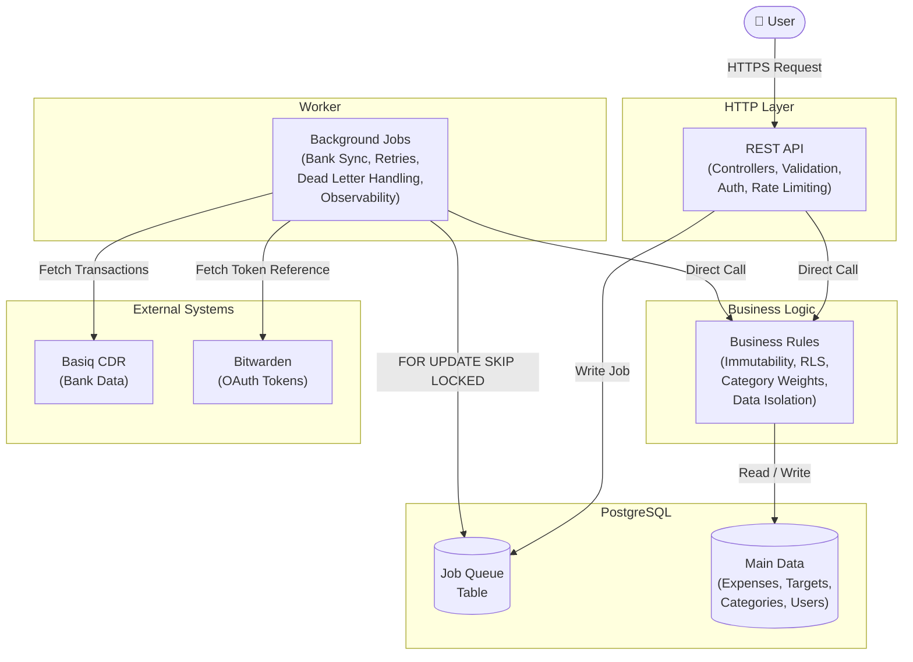

### HTTP Layer Responsibilities
---
**HTTPS enforcement** — prerequisite for everything else. Credentials and tokens are meaningless without it.
Gateway filter — runs on every request in this sequence. 

*Rate limiting first if present*, not part of version 1.0. JWT validation. Sudo token and grant check if asUserId is present.

**Three distinct failure responses:**

* 401 for invalid JWT, 

* 401 with SUDO_TOKEN_REQUIRED for missing sudo token, 

* 403 for invalid grant.

**Request validation** — structural checks only. Required fields present, correct types, date format valid. Rejects malformed requests before they reach business logic.

**Response shaping** — translates domain objects into HTTP responses. Cons

### Worker Layer Responsibility
---
**The Worker owns two mechanisms**. A cron scheduler for partition management. A job queue consumer for everything else with centralised retry logic and dead letter escalation. Materialised view refresh under load.

**Nightly Cleanup Jobs** — expired revoked tokens, expired idempotency keys, expired access grants.

**Handlers are thin** — they own only their business work and throw exceptions on failure. The consumer owns job lifecycle entirely. External failures are treated identically to internal failures at the retry level. The dead letter record captures the specific cause for observability.

**Job queue consumer** — running but handling no job types in version 1.0. Ready for bank sync in version 2.0.


# API Design

## Identity and Access
### Registration
---
**POST `/api/v1/auth/register`**

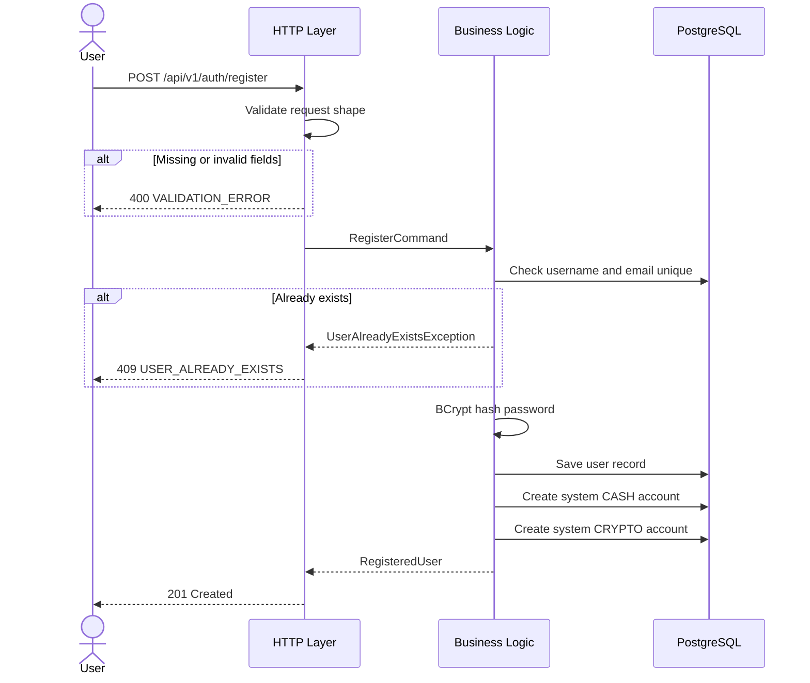

*Requirement satisfied:* Create a new user account with minimum required identity data.

*Request body:*
```json
{
  "username": "john_doe",
  "email": "john@example.com",
  "password": "plaintext_password"
}
```

*Restrictions at HTTP layer:*
- `username` non-null, non-blank, 3–50 characters
- `email` non-null, valid email format
- `password` non-null, minimum 8 characters

*Restrictions at business layer:*
- Username must be unique
- Email must be unique
- Password BCrypt hashed before storage, plaintext never persisted
- `emailVerified` set to true programmatically in version 1.0 — real email verification deferred

*Success response `201 Created`:*
```json
{
  "data": {
    "userId": "uuid",
    "username": "john_doe",
    "email": "john@example.com",
    "createdAt": "2026-05-08T10:00:00Z"
  }
}
```

*Failure responses:*

| Scenario | Status | Code |
|---|---|---|
| Missing or invalid fields | 400 | `VALIDATION_ERROR` |
| Username or email taken | 409 | `USER_ALREADY_EXISTS` |


### Login
---
**POST `/api/v1/auth/login`**

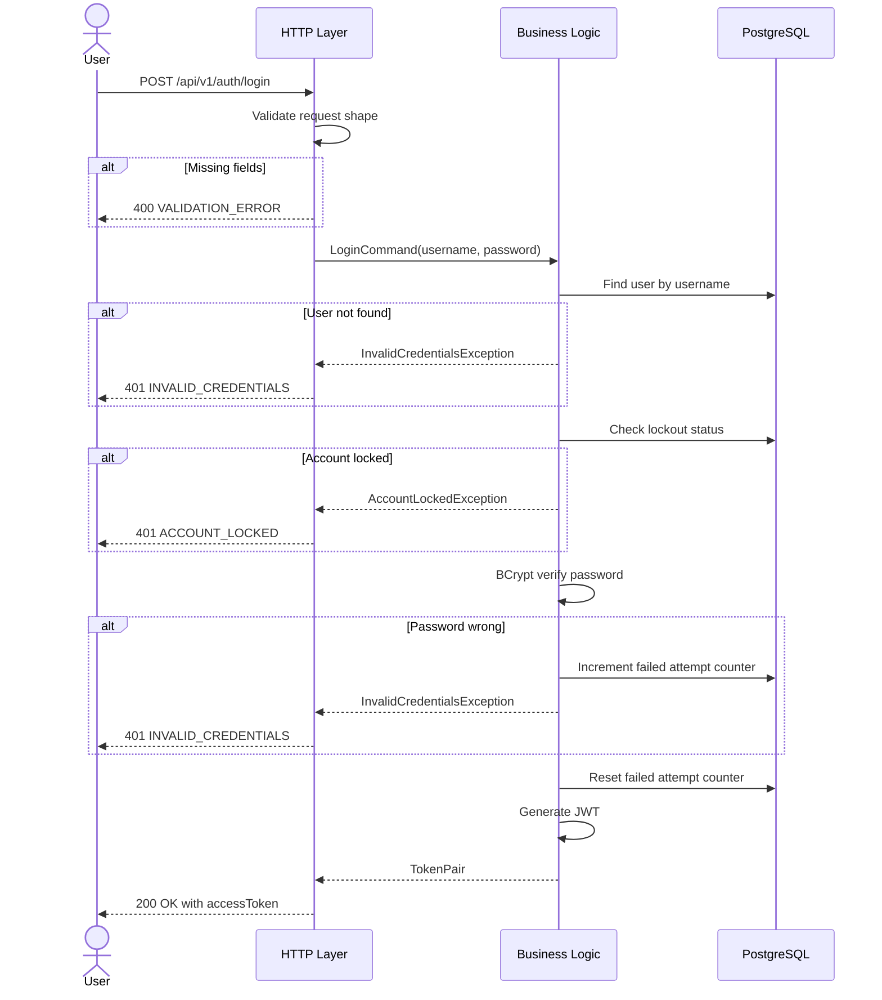


**Token lifecycle state diagram**

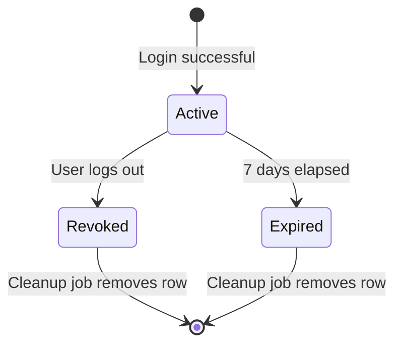

*Requirement satisfied:* User authentication — verify identity and issue a session token.

*Request body:*
```json
{
  "username": "john_doe",
  "password": "plaintext_password"
}
```

*Restrictions and validation at HTTP layer:*
- `username` non-null, non-blank
- `password` non-null, non-blank
- Both enforced structurally before reaching business logic

*Restrictions at business layer:*
- Username must exist in the system
- Password must match the stored BCrypt hash
- Account must not be locked due to brute force attempts

*Success response `200 OK`:*
```json
{
  "data": {
    "accessToken": "jwt_token",
    "expiresAt": "2026-05-16T10:00:00Z",
    "tokenType": "Bearer"
  }
}
```

*Failure responses:*

| Scenario | Status | Code |
|---|---|---|
| Missing username or password | 400 | `VALIDATION_ERROR` |
| Wrong credentials | 401 | `INVALID_CREDENTIALS` |
| Account locked | 401 | `ACCOUNT_LOCKED` |

*Security restrictions:*
- Failed login increments attempt counter
- 5 failed attempts within 10 minutes triggers 15 minute lockout
- Error message never specifies whether username or password was wrong — prevents user enumeration
- Connection must be HTTPS — enforced at server level

---

### Logout
---
**POST `/api/v1/auth/logout`**

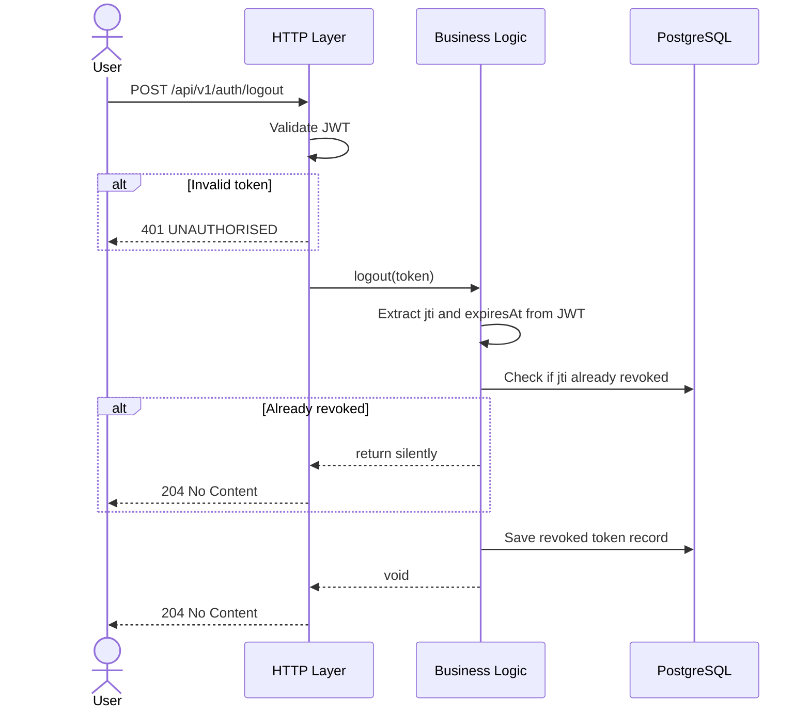

*Requirement satisfied:* Invalidate the current session token so it cannot be reused even within its expiry window.

*Request:* No body. Token taken from the `Authorization: Bearer` header.

*Restrictions:*
- Valid JWT required in header
- Idempotent — calling logout twice with the same token is safe, second call does nothing

*Success response:* `204 No Content`

*Failure responses:*

| Scenario | Status | Code |
|---|---|---|
| Missing or invalid token | 401 | `UNAUTHORISED` |


*Design note:* JWT is stateless by design — the server has no memory of it after issuance. Logout works by writing the token's `jti` claim to the revoked tokens table. The gateway filter checks this table on every subsequent request. If the `jti` is found, the request is rejected regardless of whether the token is technically still within its expiry window. A nightly cleanup job removes rows where `expiresAt` has passed since they would be rejected by expiry anyway.

### Get User Profile
---
**GET `/api/v1/users/me`**

*Requirement satisfied:* User can view their own profile.

*Request:* No body. Identity taken from JWT.

*Success response `200 OK`:*
```json
{
  "data": {
    "userId": "uuid",
    "username": "john_doe",
    "email": "john@example.com",
    "isDiscoverable": false,
    "createdAt": "2026-05-08T10:00:00Z"
  }
}
```

*Failure responses:*

| Scenario | Status | Code |
|---|---|---|
| Missing or invalid token | 401 | `UNAUTHORISED` |

### Update Profile
---
**PATCH `/api/v1/users/me`**

*Requirement satisfied:* User can update their profile. Only fields present in the request body are updated.

*Request body:*
```json
{
  "isDiscoverable": true
}
```

*Restrictions at HTTP layer:*
- At least one field must be present
- `isDiscoverable` must be boolean if present

*Success response `200 OK`:* Returns updated user object.

*Failure responses:*

| Scenario | Status | Code |
|---|---|---|
| Missing or invalid token | 401 | `UNAUTHORISED` |
| Invalid field types | 400 | `VALIDATION_ERROR` |

### Get Granted Access (Delegation)
---
**GET `/api/v1/users/me/access-grants`**

*Requirement satisfied:* User can view all grants they have given to others.

*Request:* No body.

*Success response `200 OK`:*
```json
{
  "data": [
    {
      "grantId": "uuid",
      "granteeUsername": "jane_doe",
      "accessLevel": "FULL",
      "expiresAt": "2026-05-11T10:00:00Z",
      "revokedAt": null
    }
  ]
}
```

*Failure responses:*

| Scenario | Status | Code |
|---|---|---|
| Missing or invalid token | 401 | `UNAUTHORISED` |

### Grant Access (Delegation)
---
**POST `/api/v1/users/me/access-grants`**

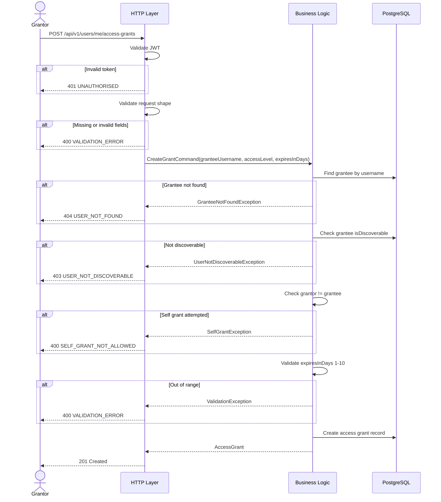

*Requirement satisfied:* User A grants User B temporary access to their data to resolve a technical issue remotely.

*Request body:*
```json
{
  "granteeUsername": "jane_doe",
  "accessLevel": "FULL",
  "expiresInDays": 3
}
```

*Restrictions at HTTP layer:*
- `granteeUsername` non-null, non-blank
- `accessLevel` non-null, must be `READ_ONLY` or `FULL`
- `expiresInDays` non-null, must be integer

*Restrictions at business layer:*
- Grantee must exist
- Grantee must have `isDiscoverable` set to true — user must opt in before another user can grant them access
- `expiresInDays` minimum 1, maximum 10
- Grantor cannot grant access to themselves

*Success response `201 Created`:*
```json
{
  "data": {
    "grantId": "uuid",
    "grantorUserId": "uuid",
    "granteeUserId": "uuid",
    "accessLevel": "FULL",
    "expiresAt": "2026-05-11T10:00:00Z"
  }
}
```

*Failure responses:*

| Scenario | Status | Code |
|---|---|---|
| Missing or invalid token | 401 | `UNAUTHORISED` |
| Invalid field values | 400 | `VALIDATION_ERROR` |
| Grantee not discoverable | 403 | `USER_NOT_DISCOVERABLE` |
| Self grant attempted | 400 | `SELF_GRANT_NOT_ALLOWED` |


The delegation is not implicit. It is explicit per request. The caller must actively declare which user's data they want to access by including `asUserId` as a query parameter.

`GET /api/v1/expenses?asUserId=<grantor-uuid>`

When `asUserId` is absent, the gateway filter retrieves the caller's own expenses.

When `asUserId` is present, the gateway filter triggers the full delegation check — validate the sudo token, validate the active grant, then run the request in the context of grantor.

*Notes*: 
1. Grants expire automatically based on expiresAt. Expiry is enforced by the gateway filter at request time, not by deletion. A background housekeeping job periodically removes expired rows for data hygiene. Security does not depend on the housekeeping job running.

1. Delegation scope is restricted to expense related endpoints only. Attempting to use asUserId on any other resource returns 400. This is enforced at the gateway filter level before the request reaches business logic.


### Remove Access Grant
---
**DELETE `/api/v1/users/me/access-grants/{grantId}`**

*Requirement satisfied:* User can revoke a grant early before it expires.

*Request:* No body.

*Success response:* `204 No Content`

*Failure responses:*

| Scenario | Status | Code |
|---|---|---|
| Missing or invalid token | 401 | `UNAUTHORISED` |
| Grant not found or belongs to different user | 404 | `GRANT_NOT_FOUND` |

## Expenses and Categories
### Create Manual Expense
---
**POST `/api/v1/expenses`**

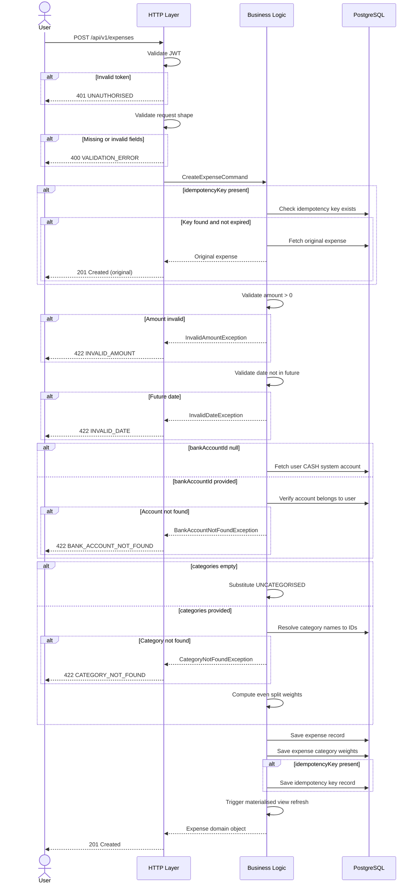

*Requirement satisfied:* User can manually create an expense with mandatory fields and optional categorisation.

*Request body:*
```json
{
  "idempotencyKey": "client-generated-uuid",
  "amount": 42.50,
  "merchantName": "Woolworths",
  "expenseDate": "2026-05-08",
  "categories": ["GROCERIES", "HOUSEHOLD"],
  "notes": "Weekly shop",
  "paymentMethod": "CREDIT_CARD",
  "bankAccountId": "uuid"
}
```

*Restrictions at HTTP layer:*
- `amount` non-null, numeric
- `merchantName` non-null, non-blank
- `expenseDate` non-null, valid date format
- `categories` optional — empty list substitutes UNCATEGORISED
- `bankAccountId` optional — null substitutes system CASH account
- `idempotencyKey` optional — if absent no idempotency protection

*Restrictions at business layer:*
- `amount` must be greater than zero
- `expenseDate` must not be in the future
- `categories` must exist in the system or user defined categories
- `bankAccountId` if provided must belong to the authenticated user
- Category weights computed server side as even split — never sent by client
- If `idempotencyKey` already exists and has not expired, return original expense without creating duplicate

*Success response `201 Created`:*
```json
{
  "data": {
    "expenseId": "uuid",
    "amount": 42.50,
    "merchantName": "Woolworths",
    "expenseDate": "2026-05-08",
    "categories": ["GROCERIES", "HOUSEHOLD"],
    "categoryWeights": {
      "GROCERIES": 21.25,
      "HOUSEHOLD": 21.25
    },
    "notes": "Weekly shop",
    "paymentMethod": "CREDIT_CARD",
    "bankAccountId": "uuid",
    "source": "MANUAL",
    "aiCategorised": false,
    "createdAt": "2026-05-08T10:30:00Z"
  }
}
```

*Failure responses:*

| Scenario | Status | Code |
|---|---|---|
| Missing or invalid fields | 400 | `VALIDATION_ERROR` |
| Amount not positive | 422 | `INVALID_AMOUNT` |
| Future date | 422 | `INVALID_DATE` |
| Category not found | 422 | `CATEGORY_NOT_FOUND` |
| Bank account not found | 422 | `BANK_ACCOUNT_NOT_FOUND` |
| Unauthorised | 401 | `UNAUTHORISED` |

*Design notes:*

`categoryWeights` is computed server side and never accepted from the client. The client sends category names, the server assigns weights. This prevents a client from sending manipulated weights that would corrupt reporting and predictions.

`idempotencyKey` is client generated. If a network failure causes the client to retry, the server detects the duplicate key and returns the original expense silently. Safe retries without duplicate records.

`expenseDate` is a date not a datetime. Time of purchase is rarely known and not required for any reporting or prediction function.

### Get a Single Expense
---
**GET `/api/v1/expenses/{expenseId}`**

*Requirement satisfied:* User can retrieve a single expense by ID.

*Query parameters:*
- `expenseDate` required — date format, needed for composite key lookup on partitioned table
- `asUserId` optional — delegation, expense module only

*Success response `200 OK`:* Returns single expense object as above.

*Failure responses:*

| Scenario | Status | Code |
|---|---|---|
| Expense not found or belongs to different user | 404 | `EXPENSE_NOT_FOUND` |
| Unauthorised | 401 | `UNAUTHORISED` |


---

### Get Expenses Via Filter
---
**GET `/api/v1/expenses`**

*Requirement satisfied:* User can list and filter expenses across multiple dimensions.

*Query parameters:*

| Parameter | Type | Required | Notes |
|---|---|---|---|
| `dateFrom` | date | optional | |
| `dateTo` | date | optional | |
| `merchantName` | string | optional | partial match |
| `categories` | string[] | optional | comma separated |
| `paymentMethod` | string | optional | |
| `bankAccountId` | uuid | optional | |
| `minAmount` | decimal | optional | |
| `maxAmount` | decimal | optional | |
| `source` | string | optional | MANUAL, BANK_IMPORT, default ALL |
| `page` | int | optional | default 1 |
| `pageSize` | int | optional | default 20, max 100 |
| `sortBy` | string | optional | default expenseDate |
| `sortOrder` | string | optional | ASC or DESC, default DESC |
| `asUserId` | uuid | optional | delegation, requires sudo token |

*Success response `200 OK`:*
```json
{
  "data": [...],
  "pagination": {
    "page": 1,
    "pageSize": 20,
    "totalItems": 143,
    "totalPages": 8
  }
}
```

*Failure responses:*

| Scenario | Status | Code |
|---|---|---|
| dateFrom after dateTo | 400 | `INVALID_DATE_RANGE` |
| Invalid sort field | 400 | `INVALID_SORT_FIELD` |
| Unauthorised | 401 | `UNAUTHORISED` |

*Design note:* 
1. All filters are combinable and all optional. No filter returns all expenses for the authenticated user paginated by date descending. 

1. This endpoint hits the read replica, not the primary (Not part of version 1.0). Maximum staleness of 60 seconds applies.

1. All queries implicitly filter deletedAt IS NULL.

### Get Pre-computed Expense Summaries
---
**GET `/api/v1/expenses/summary`**

*Requirement satisfied:* User can ask aggregated questions about their spending — total by category, by merchant, or by month.

*Query parameters:*

| Parameter | Type | Required | Notes |
|---|---|---|---|
| `dateFrom` | date | required | |
| `dateTo` | date | required | |
| `groupBy` | string | required | CATEGORY, MERCHANT, MONTH |
| `asUserId` | uuid | optional | delegation |

*Success response `200 OK`:*
```json
{
  "data": {
    "totalAmount": 1243.50,
    "periodFrom": "2026-05-01",
    "periodTo": "2026-05-08",
    "groups": [
      {
        "groupKey": "GROCERIES",
        "totalAmount": 423.75,
        "transactionCount": 8,
        "percentageOfTotal": 34.1
      }
    ],
    "dataFreshAsOf": "2026-05-08T10:29:45Z"
  }
}
```

*Failure responses:*

| Scenario | Status | Code |
|---|---|---|
| Missing required parameters | 400 | `VALIDATION_ERROR` |
| dateFrom after dateTo | 400 | `INVALID_DATE_RANGE` |
| Invalid groupBy value | 400 | `INVALID_GROUP_BY` |
| Unauthorised | 401 | `UNAUTHORISED` |

*Design note:* `dataFreshAsOf` tells the client exactly how stale the data is — derived from the materialised view's last refresh timestamp. The client can display "data as of 45 seconds ago" rather than hiding staleness from the user. This endpoint hits materialised views, not raw expense tables.

---

### Modify a Single Expense
---
**PATCH `/api/v1/expenses/{expenseId}`**

*Requirement satisfied:* User can update a manually entered expense. Bank imported expenses can only have categories and notes updated.

*Query parameters:*
- `expenseDate` required
- `asUserId` optional

*Request body:*
```json
{
  "amount": 50.00,
  "merchantName": "Woolworths Metro",
  "expenseDate": "2026-05-08",
  "categories": ["GROCERIES"],
  "notes": "Updated note",
  "paymentMethod": "DEBIT_CARD"
}
```

*Restrictions at HTTP layer:*
- All fields optional — only fields present are updated
- Field types validated if present

*Restrictions at business layer:*
- Bank imported expenses — `amount`, `merchantName`, `expenseDate`, `paymentMethod` are immutable
- Attempting to update immutable fields on a bank imported expense returns 422
- Category weights recomputed server side if categories change
- Soft deleted expenses cannot be updated

*Failure responses:*

| Scenario | Status | Code |
|---|---|---|
| Expense not found | 404 | `EXPENSE_NOT_FOUND` |
| Immutable field update attempted | 422 | `FIELD_IMMUTABLE_FOR_BANK_IMPORT` |
| Unauthorised | 401 | `UNAUTHORISED` |

---

### Delete Manual Expense
---
**DELETE `/api/v1/expenses/{expenseId}`**

*Requirement satisfied:* User can remove a manually entered expense. Bank imported expenses cannot be deleted.

*Query parameters:*
- `expenseDate` required
- `asUserId` optional

*Request:* No body.

*Success response:* `204 No Content`

*Failure responses:*

| Scenario | Status | Code |
|---|---|---|
| Expense not found | 404 | `EXPENSE_NOT_FOUND` |
| Bank imported expense deletion attempted | 422 | `BANK_IMPORT_IMMUTABLE` |
| Unauthorised | 401 | `UNAUTHORISED` |

*Design note:* Soft delete only. Sets `deletedAt` timestamp. The row is never physically removed. All list and summary endpoints filter out soft deleted expenses by default. `includeDeleted=true` on the list endpoint shows them. This satisfies the data retention requirement — records are never destroyed.

### Modify a Single Category
---
**PATCH `/api/v1/categories/{categoryId}`**

*Requirement satisfied:* User can update the name or description of their own user defined categories.

*Request body:*
```json
{
  "name": "FOOD_AND_GROCERY",
  "description": "Updated description"
}
```

*Restrictions at HTTP layer:*
- All fields optional — only fields present are updated
- `name` maximum 100 characters if present

*Restrictions at business layer:*
- System categories cannot be modified — enforced by DB trigger and application layer
- Category must belong to the authenticated user
- Updated name must not conflict with an existing category name for this user

*Success response `200 OK`:*
```json
{
  "data": {
    "categoryId": "uuid",
    "name": "FOOD_AND_GROCERY",
    "description": "Updated description",
    "isSystem": false,
    "createdAt": "2026-05-08T10:00:00Z"
  }
}
```

*Failure responses:*

| Scenario | Status | Code |
|---|---|---|
| Category not found or belongs to different user | 404 | `CATEGORY_NOT_FOUND` |
| System category modification attempted | 422 | `SYSTEM_CATEGORY_IMMUTABLE` |
| Name conflict | 409 | `CATEGORY_ALREADY_EXISTS` |
| Unauthorised | 401 | `UNAUTHORISED` |

## Predictions
### Create a Single Target
---
**POST `/api/v1/targets`**

*Requirement satisfied:* User can define a spending target with amount, period, and scope.

*Request body:*
```json
{
  "targetType": "CATEGORY",
  "amount": 400.00,
  "periodYear": 2026,
  "periodMonth": 5,
  "categories": [
    {
      "categoryId": "uuid",
      "participation": "INCLUSIVE"
    },
    {
      "categoryId": "uuid",
      "participation": "EXCLUSIVE"
    }
  ]
}
```

*Restrictions at HTTP layer:*
- `targetType` non-null, must be `CATEGORY`, `MULTI_CATEGORY`, or `TOTAL`
- `amount` non-null, numeric
- `periodYear` non-null, valid year
- `periodMonth` non-null, integer 1 to 12
- `categories` optional — empty or absent means total spending target

*Restrictions at business layer:*
- `amount` must be greater than zero
- `periodYear` and `periodMonth` combination must not already have an active target of the same scope
- `CATEGORY` type must have exactly one inclusive category and no exclusive categories
- `TOTAL` type can have zero or more exclusive categories but no inclusive categories
- `MULTI_CATEGORY` type must have two or more inclusive categories
- All category IDs must belong to the authenticated user's visible categories
- Period cannot be in the past — no point setting targets for old periods

*Success response `201 Created`:*
```json
{
  "data": {
    "targetId": "uuid",
    "targetType": "CATEGORY",
    "amount": 400.00,
    "periodYear": 2026,
    "periodMonth": 5,
    "categories": [
      {
        "categoryId": "uuid",
        "categoryName": "DINING",
        "participation": "INCLUSIVE"
      }
    ],
    "createdAt": "2026-05-08T10:00:00Z"
  }
}
```

*Failure responses:*

| Scenario | Status | Code |
|---|---|---|
| Missing or invalid fields | 400 | `VALIDATION_ERROR` |
| Amount not positive | 422 | `INVALID_AMOUNT` |
| Duplicate target for period | 409 | `TARGET_ALREADY_EXISTS` |
| Invalid category combination for type | 422 | `INVALID_TARGET_SCOPE` |
| Category not found | 422 | `CATEGORY_NOT_FOUND` |
| Unauthorised | 401 | `UNAUTHORISED` |

### Get Targets by Date
---
**GET `/api/v1/targets`**

*Requirement satisfied:* User can list all their targets optionally filtered by period.

*Query parameters:*

| Parameter | Type | Required | Notes |
|---|---|---|---|
| `periodYear` | int | optional | |
| `periodMonth` | int | optional | |
| `targetType` | string | optional | |

*Success response `200 OK`:* Array of target objects as above.

*Failure responses:*

| Scenario | Status | Code |
|---|---|---|
| Unauthorised | 401 | `UNAUTHORISED` |

### Get Target's Porjection Status
---
**GET `/api/v1/targets/{targetId}/status`**

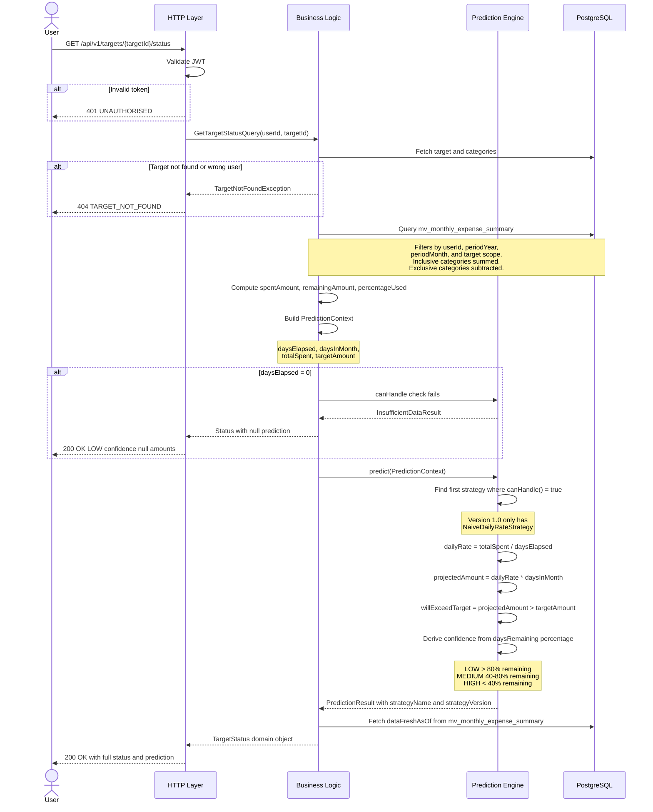

*Requirement satisfied:* User can check progress against a target and get a projection of whether it will be exceeded by end of month.

*Request:* No body.

*Success response `200 OK`:*
```json
{
  "data": {
    "targetId": "uuid",
    "targetAmount": 400.00,
    "spentAmount": 187.50,
    "remainingAmount": 212.50,
    "percentageUsed": 46.9,
    "prediction": {
      "projectedAmount": 468.75,
      "willExceedTarget": true,
      "projectedExceedanceAmount": 68.75,
      "strategyUsed": "NAIVE_DAILY_RATE",
      "strategyVersion": "v1.0",
      "confidence": "MEDIUM",
      "daysElapsed": 12,
      "daysRemainingInPeriod": 18
    },
    "dataFreshAsOf": "2026-05-08T10:29:45Z"
  }
}
```

*Failure responses:*

| Scenario | Status | Code |
|---|---|---|
| Target not found | 404 | `TARGET_NOT_FOUND` |
| Insufficient data for prediction | 200 | prediction node returned with null projectedAmount and LOW confidence |
| Unauthorised | 401 | `UNAUTHORISED` |

*Design notes:*

`strategyUsed` and `strategyVersion` expose which prediction strategy ran. When the algorithm changes in a future version, a new strategy class is created with a new version string. Historical predictions can be reproduced by re-running the same version against the same context. The old strategy class is never modified or deleted.

`dataFreshAsOf` is derived from the materialised view's last refresh timestamp. The spent amount comes from the view, not the raw expenses table.

Insufficient data is not an error — it returns 200 with a prediction node that has null amounts and LOW confidence. The client can display "not enough data yet" rather than an error state.

### Remove a Single Target
---
**DELETE `/api/v1/targets/{targetId}`**

*Requirement satisfied:* User can remove a target they no longer need.

*Request:* No body.

*Success response:* `204 No Content`

*Failure responses:*

| Scenario | Status | Code |
|---|---|---|
| Target not found | 404 | `TARGET_NOT_FOUND` |
| Unauthorised | 401 | `UNAUTHORISED` |

*Design note:* Soft delete only. Historical target data is retained for future trend analysis. A deleted target does not appear in list queries but its data remains in the database.

# Package Design
**Core**, **adapters**, **API**, and **worker** are the packages

**Core** contains domain objects, port interfaces, and service layer. It has no infrastructure dependencies. This keeps business logic independently testable with plain Java — no Spring context, no database needed.

**Adapters** implement the port interfaces defined in core. They handle infrastructure translation — JPA, Basiq, Bitwarden. Nothing else.

**API** controllers translate HTTP requests into commands and pass them to core services. Translation stays at the boundary and never leaks inward.

**Worker** owns the scheduler and job queue consumer. Calls core services and adapters directly — no HTTP involved.

Dependencies point inward. Core knows nothing about adapters, API, or worker. Adapters know core. API and worker know both. The compiler enforces this — a boundary violation fails the build.

```
core/
├── domain/     (pure data carriers)
├── ports/      (infrastructure contracts)
└── services/   (orchestration logic)

adapters/       (infrastructure implementations)

api/
├── controllers/    (HTTP translation, command building)
├── security/       (JWT filter, RLS session)
├── aspects/        (RefreshMaterializedViewAspect)
└── config/         (SecurityConfig, JwtConfig,DatabaseConfig)

worker/
├── scheduler   (cron jobs)
└── consumer    (polling loop, handlers)
```

# Design Patterns
## Prediction Engine

**Prediction engine — summary**

Two interfaces. `PredictionStrategy` defines what each rule must implement — `shouldRun` to declare eligibility and `calculate` to run the logic. `PredictionEngine` defines what each engine must implement — `run` to orchestrate the chain.

The engine iterates its ordered list of strategies, calls `shouldRun` on each, and delegates to `calculate` on the first match. A default strategy with no entry criteria always sits last — it guarantees the chain never falls through empty handed.

## Materialised View Refresh

Refresh is a cross-cutting concern. Putting it in every service method creates duplication and a silent failure risk when forgotten. AOP solves this by intercepting any method annotated with `@RefreshMaterializedView` and triggering the refresh transparently after successful completion. The aspect lives in `api/aspects`. Services declare intent through the annotation and never call refresh explicitly.

## RLS Enforcement

The requirement is strict data isolation between users. A bug in application code should not be enough to leak data. Enforcement must exist independently at the database layer.

**Three independent layers**

First, application layer. The JWT filter validates the token on every request and sets the `UserPrincipal` in the Spring `SecurityContext`. This is the source of truth for who the current user is.

Second, aspect layer. `RLSPolicyEnforcer` in `api/aspects` intercepts every method under the repository package using a package level pointcut — no annotation needed on individual methods. Before any repository method executes it runs `SET LOCAL app.current_user_id = :userId` taking the user ID from the `SecurityContext`. `SET LOCAL` scopes the variable to the current transaction only — solving the HikariCP connection reuse problem. When the transaction ends the variable is cleared.

Third, database layer. A RESTRICTIVE RLS policy defined once in Flyway migration scripts enforces row level filtering on every query. PostgreSQL rewrites every query transparently to add `WHERE user_id = current_setting('app.current_user_id')::uuid`. RESTRICTIVE mode means if the session variable is missing the query returns zero rows — no silent failures.

## HTTP to Domain Translation
The controller's job is to handle HTTP and route to the right service. Translation from HTTP request to domain command is part of that responsibility.

For version 1.0 the controller directly instantiates the command from the request parameters. No intermediate class is needed because the translation is straightforward — the controller passes the parameters directly into the command constructor.

A mapper class was considered but ruled out. It is the same thing as the direct instantiation but with an unnecessary intermediate class involved. Both approaches are equally extensible — adding a new endpoint means adding a new command in both cases. The mapper adds indirection without adding value for MVP.

A factory was also considered but ruled out. A factory implies a runtime decision about which translator to use. Our translations are not dynamic — `CreateExpenseRequest` always maps to `CreateExpenseCommand`. There is no condition to evaluate so a factory solves a problem that does not exist.

When mapping logic grows complex enough to warrant extraction — for example when response objects require complex assembly from multiple domain objects — a mapper class is the natural next step. MapStruct can then generate the boilerplate automatically from interface definitions. That is a future decision driven by a real problem, not an upfront architecture decision.

## Stale Domain Object Snapshots

Domain records — `UserProfile`, `Expense`, `Target`, and others — are immutable snapshots of DB state at the moment they were fetched. Within a single logical operation, holding two snapshots of the same entity taken at different times produces an inconsistency: both objects claim to represent the same row, but one reflects state from before an update and the other from after.

**The concrete risk**

A future service method that calls `getProfile`, passes the result to another service, then calls `updateDiscoverability`, and uses both results together is holding two snapshots from two different points in time. Any field that changed between the two reads will be inconsistent across the two objects.

**Safe patterns**

- Read once at the start of the operation and pass that single snapshot through. Do not re-fetch mid-operation unless the intent is explicitly to refresh.
- Wrap the entire logical operation in one `@Transactional` boundary. All reads inside the transaction see the same consistent DB snapshot under PostgreSQL's default read committed isolation.
- Where concurrent writes are possible and correctness depends on detecting them, use optimistic locking — `@Version` on the entity. A stale read that tries to write will fail with `OptimisticLockException` and retry rather than silently corrupting data.

**Why this does not apply in MVP v1.0**

No service method in the current codebase holds multiple snapshots of the same entity within a single logical operation. Each controller calls one service method, which does one read, one optional write, and returns. The pattern becomes a real design constraint only when service methods grow to orchestrate multiple reads and writes over a single request — which is the natural direction as complexity increases.

## Worker Layer

**Worker layer — summary**

The Worker is a separate process responsible for system housekeeping. Its only mechanism in version 1.0 is a cron scheduler. The job queue consumer exists in the code but processes no job types until version 2.0 when bank sync arrives.

**The ScheduledJob interface**

Every cron job implements a single `ScheduledJob` interface defined in `core/ports`. The interface has one method — `execute(ScheduledContext context)`. `ScheduledContext` is defined in `core/domain` and carries execution context such as current date and what triggered the job. The reason it accepts a context object rather than no parameters is future extensibility — adding fields to `ScheduledContext` does not break existing implementations. The interface lives in `core/ports` so both the Worker and any future HTTP triggered job can use the same contract without depending on each other.

**Each job calls core services**

Each cron job implementation calls a service in `core/services`. The core service calls a repository port defined in `core/ports`. The adapter in the `adapters` package implements that port with the actual SQL. This keeps the Worker and the core service free of infrastructure dependencies. The dependency rule holds — nothing points outward toward infrastructure.

**Idempotency by fixed condition**

All jobs are idempotent by design. Idempotency is achieved by using a fixed condition that naturally includes previously targeted objects. For example the expired token cleanup job deletes all tokens where `expiresAt` is less than today. Re-running the job tomorrow includes yesterday's expired tokens too — they are already deleted so the delete has no effect. The condition never changes between runs which guarantees re-running either fixes the issue or produces no side effect. This means failure handling is simple — re-run the job. No complex rollback or compensation logic needed.

**Failure handling**

Failures are captured in structured JSON logs with full context. Version 1.0 accepts this as sufficient given the low probability of failure for simple housekeeping jobs. Annual partition jobs run daily throughout December — if they fail one day they automatically retry the next. Success stops subsequent runs naturally because the partition already exists. Version 1.1 adds a simple email alert on repeated failure.

**Jobs in version 1.0**

Partition creation runs daily throughout December and checks whether next year's partition exists before creating it. Partition archival runs daily throughout January. Expired token cleanup runs nightly and deletes all tokens where `expiresAt` is less than today. Idempotency key cleanup runs nightly on the same principle. Access grant cleanup runs nightly removing expired grant rows for data hygiene — security enforcement happens at the gateway filter independently.

# Table Design (ERD)

## Users Table

Stores persistent identity data for each registered user.

```
id              UUID PRIMARY KEY
username        VARCHAR(50) NOT NULL UNIQUE        (3-50 chars enforced)
email           VARCHAR(255) NOT NULL UNIQUE       (format check constraint)
password        VARCHAR(255) NOT NULL              (BCrypt hash, never plaintext)
is_discoverable BOOLEAN NOT NULL DEFAULT FALSE     (opt-in for being granted access)
locked_until    TIMESTAMP WITH TIME ZONE NULL      (set when 5 failures hit, cleared on success or expiry)
created_at      TIMESTAMP WITH TIME ZONE NOT NULL  (audit, not updatable)
modified_at     TIMESTAMP WITH TIME ZONE NOT NULL  (audit, not directly updatable)
created_by      UUID REFERENCES users(id)          (audit, not updatable)
modified_by     UUID REFERENCES users(id)          (audit, not directly updatable)
```

Maps to F1, F2, F4, F5, F6, F8, N4, N13.

## User Login Failures Table

Tracks recent failed login attempts within the 10 minute window. Used to determine when to trigger the 15 minute lockout on the users table.

```
id          BIGINT GENERATED ALWAYS AS IDENTITY PRIMARY KEY
user_id     UUID NOT NULL REFERENCES users(id) ON DELETE CASCADE
login_date  TIMESTAMP WITH TIME ZONE NOT NULL
source      VARCHAR(255) NOT NULL DEFAULT 'API'
```

No index needed — table bounded to 5 rows per user maximum due to cleanup-on-insert and cleared on successful login. Maximum 100 rows total at this scale. Maps to F4.

---

**Cross-Cutting Decision — Audit Columns**

Every table gets the four audit columns — `created_at`, `modified_at`, `created_by`, `modified_by`. `created_*` are never updatable. `modified_*` are not directly updatable from the application — they update automatically via a database trigger on every UPDATE.

This will be assumed for every subsequent table without restating it.

## Revoked Token Table

```
jti        UUID PRIMARY KEY                         (JWT ID from logged out token)
user_id    UUID NOT NULL REFERENCES users(id)        (audit context)
expires_at TIMESTAMP WITH TIME ZONE NOT NULL          (cleanup trigger)
```

Plus cross-cutting audit columns. `created_at` serves as the revocation timestamp.

Maps to F3, N5.

The `jti` UUID is the primary key — small, fixed size, never stores the full token. Compromise of this table reveals identifiers, not valid tokens.

Cleanup job removes rows where `expires_at <= NOW()`. Maps to F36.

## Sudo Token Table

```
token_hash       VARCHAR(64) PRIMARY KEY                  (SHA-256 hex of the raw token)
grantor_id       UUID NOT NULL REFERENCES users(id)
grantee_id       UUID NOT NULL REFERENCES users(id)
expires_at       TIMESTAMP WITH TIME ZONE NOT NULL
```

Plus cross-cutting audit columns.

**The Lifecycle**

User triggers a sudo token creation. Server generates a cryptographically secure random 32-byte token. Server computes SHA-256 hash of the token. Server stores the hash in the database with grantor, grantee, and expiry. Server returns the raw token to the user — once. The raw token is never stored.

On every delegation request, the user presents the raw token in a header. The gateway filter hashes the incoming token, looks up the hash in the database, validates it belongs to the claimed grantor and grantee, and checks expiry. If all valid, delegation proceeds.

**Cleanup**

When a grant is revoked early, the associated sudo token rows are deleted as part of the revocation flow.

When a sudo token expires naturally, the nightly cleanup job removes rows where `expires_at <= NOW()`. Maps to F36.

**Why SHA-256 not BCrypt for this case**

BCrypt is intentionally slow to defend against offline brute force on passwords. Sudo tokens are 256-bit random values — brute force is computationally infeasible regardless of hash speed. SHA-256 is fast and sufficient. BCrypt would add latency to every delegation request for no security benefit.

Maps to F7, F11, N10.


## Bank Table

```
id          UUID PRIMARY KEY
name        VARCHAR(255) NOT NULL
abn         VARCHAR(11) NOT NULL UNIQUE
CHECK (LENGTH(abn) = 11 AND abn ~ '^[0-9]+$')
```

Plus cross-cutting audit columns.

Public reference data. No RLS enabled. All authenticated users read the same list. Populated via Flyway seed scripts at DB startup with major Australian banks — CBA, ANZ, NAB, Westpac, Macquarie, Bendigo, ING, ME Bank, and similar. Same seed runs in both personal and demo deployments.

Maps to F20 (bank account selection for expenses).

## Bank Account Table

```
id              UUID PRIMARY KEY
user_id         UUID NOT NULL REFERENCES users(id)
bank_id         UUID NULL REFERENCES banks(id)
name            VARCHAR(50) NOT NULL
account_type    VARCHAR(20) NOT NULL CHECK (account_type IN ('CASH', 'CRYPTO', 'BANK'))
is_system       BOOLEAN NOT NULL DEFAULT FALSE
CHECK ((account_type = 'BANK' AND bank_id IS NOT NULL) 
    OR (account_type != 'BANK' AND bank_id IS NULL))
UNIQUE (user_id, name)
```

Plus cross-cutting audit columns.

RLS enforced via `user_id` — every user only sees their own accounts.

**Population in v1.0**

CASH and CRYPTO system accounts created at registration for every user. Application code in the registration flow handles this.

Real bank accounts seeded via Flyway for known personal users only. Demo deployment does not seed any real bank accounts — demo users only have CASH and CRYPTO. This is achieved by separating Flyway migration locations per deployment environment.

Maps to F20, N10.

## Category Table

```
id          UUID PRIMARY KEY
user_id     UUID NULL REFERENCES users(id)
name        VARCHAR(50) NOT NULL
description VARCHAR(255) NULL
parent_id   UUID NULL REFERENCES categories(id)
```

Plus cross-cutting audit columns.

**Distinguishing System From User Categories**

`user_id IS NULL` means a system category. `user_id NOT NULL` means a private user category. No separate `is_system` column — it would be redundant and risks inconsistency.

**RLS Policy**

```sql
CREATE POLICY category_isolation ON categories
USING (user_id IS NULL 
    OR user_id = current_setting('app.current_user_id')::uuid);
```

A category is visible if it is a system category or belongs to the current user.

**Uniqueness — Partial Indexes**

```sql
CREATE UNIQUE INDEX uq_system_category_name 
ON categories (name) 
WHERE user_id IS NULL;

CREATE UNIQUE INDEX uq_user_category_name 
ON categories (user_id, name) 
WHERE user_id IS NOT NULL;
```

System-wide names are unique. User-scoped names are unique per user. User A and User B can both have a "PETROL" — they do not conflict with each other or with the system version.

System category descriptions follow the format `"System generated - <NAME>"`. For example, the GROCERIES system category has description `"System generated - GROCERIES"`. This is set in the Flyway seed script.


**Parent-Child Rule**

System categories cannot have user categories as parents — that would expose private data via the hierarchy. The reverse is allowed.

Enforced by application-layer validation in v1.0. A trigger can be added later if the codebase grows.

No runtime validation needed. System categories only enter the table via Flyway in v1.0. Users only create user categories which have their own descriptions. The two cases are disjoint by deployment process.

When v2.0 introduces promotion, the promotion script will explicitly set the description according to the same convention or whatever the admin chooses at that time.

**Population in v1.0**

Flyway seeds useful system categories at DB startup — UNCATEGORISED, GROCERIES, DINING, TRANSPORT, UTILITIES, RENT, ENTERTAINMENT, HEALTHCARE, and similar. Same seed runs in both personal and demo deployments.

Users create their own categories via the existing `POST /api/v1/categories` endpoint. No promotion mechanism in v1.0 — deferred to v2.0 as an admin operation requiring manual SQL.

Maps to F14, F15, F17, F19, N10, N14.


## Expense Table

```sql
CREATE TABLE expenses (
    id              UUID NOT NULL,
    user_id         UUID NOT NULL REFERENCES users(id),
    amount          DECIMAL(10,2) NOT NULL CHECK (amount > 0),
    merchant_name   VARCHAR(255) NOT NULL,
    expense_date    DATE NOT NULL CHECK (expense_date <= CURRENT_DATE),
    payment_method  VARCHAR(20) NOT NULL CHECK (payment_method IN 
                      ('CASH', 'CREDIT_CARD', 'DEBIT_CARD', 'BANK_TRANSFER', 'OTHER')),
    bank_account_id UUID NOT NULL REFERENCES bank_accounts(id),
    notes           TEXT NULL,
    source          VARCHAR(20) NOT NULL DEFAULT 'MANUAL' 
                      CHECK (source IN ('MANUAL', 'BANK_IMPORT')),
    deleted_at      TIMESTAMP WITH TIME ZONE NULL,
    PRIMARY KEY (id, expense_date)
) PARTITION BY RANGE (expense_date);
```

Plus cross-cutting audit columns.

**Partitioning**

Yearly partitions. The `partition_registry` table tracks which years exist and their status (active or archived). The worker creates next year's partition every December and archives the oldest year every January. Active partitions cover 5 years.

**Composite Primary Key**

`(id, expense_date)` — required by PostgreSQL when partitioning on `expense_date`. This is why single expense lookups require both id and date as parameters in the API.

**RLS Enforced on user_id**

Standard policy. Every query rewrites with `WHERE user_id = current_setting('app.current_user_id')`.

**Deferred to v2.0**

`fingerprint` for soft deduplication, `external_transaction_id` for Basiq, `bank_status` for pending vs settled, `merged_from` for duplicate resolution audit, `ai_categorised` for AI categorisation. Added via migration when needed.

Maps to F20, F21, F22, F23, F24, F26, N9, N10, N11, N12.


## Expense Category Table

```sql
CREATE TABLE expense_categories (
    expense_id      UUID NOT NULL,
    expense_date    DATE NOT NULL,
    category_id     UUID NOT NULL REFERENCES categories(id),
    user_id         UUID NOT NULL REFERENCES users(id),
    weight_amount   DECIMAL(10,2) NOT NULL CHECK (weight_amount > 0),
    PRIMARY KEY (expense_id, expense_date, category_id),
    FOREIGN KEY (expense_id, expense_date) REFERENCES expenses(id, expense_date)
);
```

Plus cross-cutting audit columns.

`expense_id` and `expense_date` together reference the parent expense — the composite FK is required because the expenses table primary key is composite due to partitioning.

`category_id` references the category linked to this expense.

`user_id` denormalised from the expense for RLS efficiency. Safe to denormalise because expense ownership never changes after creation.

`weight_amount` stores the pre-computed even split at write time. A $100 expense across 4 categories stores 4 rows with $25 each. Eliminates recomputation on every aggregation query and makes the data resilient to future changes in split logic.

**Primary Key Composition**

`(expense_id, expense_date, category_id)` prevents the same expense from being linked to the same category twice. No surrogate ID needed — the natural composite key is sufficient.

**RLS**

Standard policy on `user_id`. Every query rewrites with the current user filter.

Maps to F19, F20, F26, N10.

## Idempotency Keys

```sql
CREATE TABLE idempotency_keys (
    user_id          UUID NOT NULL REFERENCES users(id),
    idempotency_key  VARCHAR(255) NOT NULL,
    expense_id       UUID NOT NULL,
    expense_date     DATE NOT NULL,
    expires_at       TIMESTAMP WITH TIME ZONE NOT NULL 
                       DEFAULT NOW() + INTERVAL '24 hours',
    PRIMARY KEY (user_id, idempotency_key),
    FOREIGN KEY (expense_id, expense_date) REFERENCES expenses(id, expense_date)
);
```

Plus cross-cutting audit columns.

**Why Each Field Exists**

`user_id` and `idempotency_key` together form the lookup. The same key from different users does not conflict — scoped by user.

`expense_id` and `expense_date` link to the expense created by the original request. Required so the server can return the original expense on a duplicate request rather than just rejecting it.

`expires_at` defaults to 24 hours from creation. Standard industry retry window. Cleanup job removes expired rows nightly.

**On not Hashing**

Idempotency keys are client-generated identifiers, not credentials. Storing them in plain text is no different from storing the `jti` claim from a JWT. No security risk.

**Primary Key**

Composite natural key `(user_id, idempotency_key)`. No surrogate UUID — this is a leaf table referenced by nothing.

**RLS**

Standard policy on `user_id`.

**Cleanup**

The nightly cleanup job in the Worker removes rows where `expires_at <= NOW()`. Maps to F36.

Maps to F27, N10.

## Target and Target Category Tables

**targets and target_categories tables — summary**

```sql
CREATE TABLE targets (
    id           UUID PRIMARY KEY,
    user_id      UUID NOT NULL REFERENCES users(id),
    target_type  VARCHAR(20) NOT NULL 
                   CHECK (target_type IN ('CATEGORY', 'MULTI_CATEGORY', 'TOTAL')),
    amount       DECIMAL(10,2) NOT NULL CHECK (amount > 0),
    period_year  INTEGER NOT NULL,
    period_month INTEGER NOT NULL CHECK (period_month BETWEEN 1 AND 12),
    deleted_at   TIMESTAMP WITH TIME ZONE NULL
);

CREATE TABLE target_categories (
    target_id           UUID NOT NULL REFERENCES targets(id),
    category_id         UUID NOT NULL REFERENCES categories(id),
    user_id             UUID NOT NULL REFERENCES users(id),
    participation_type  VARCHAR(20) NOT NULL DEFAULT 'INCLUSIVE'
                          CHECK (participation_type IN ('INCLUSIVE', 'EXCLUSIVE')),
    PRIMARY KEY (target_id, category_id)
);
```

Plus cross-cutting audit columns on both.

**Why the split into two tables**

The target itself has one amount and one period. Its scope can span one or many categories with inclusive or exclusive participation. Separating scope into a junction table handles all three target types — `CATEGORY`, `MULTI_CATEGORY`, `TOTAL` — through a single unified mechanism.

A `CATEGORY` target has one junction row with `INCLUSIVE`. A `MULTI_CATEGORY` target has multiple `INCLUSIVE` rows. A `TOTAL` target has zero or more `EXCLUSIVE` rows. The application enforces which combinations are valid per type.

**On `period_year` and `period_month` as separate fields**

Matches the API contract directly. Easier to query than parsing a date field. Composite year and month gives natural sort and filter.

**On `deleted_at` for soft delete**

Targets are soft deleted only. Historical data retained for future trend analysis.

**On `participation_type` defaulting to INCLUSIVE**

Default behaviour matches the common case. Most targets are inclusive. Exclusion is the special case for total spending targets with carve-outs.

**On denormalised `user_id` in target_categories**

Same pattern as expense_categories. Junction table carries `user_id` for direct RLS enforcement. Safe because target ownership never changes after creation.

**Uniqueness for active target per period and scope**

Deferred to application layer in v1.0. Two active targets for the same scope and period are technically allowed by the schema but the application prevents creation. Adequate at this scale.

Maps to F28, F29, F30, F31, N10, N15.

## Partition Registry Table

```sql
CREATE TABLE partition_registry (
    partition_year SMALLINT PRIMARY KEY,
    status         VARCHAR(10) NOT NULL CHECK (status IN ('ACTIVE', 'ARCHIVED'))
);
```

Plus cross-cutting audit columns.

**Why Each Field Exists**

`partition_year` is the natural primary key — one row per year.

`status` distinguishes active partitions (queried by current operations) from archived ones (excluded from materialised views, preserved in cold storage for future querying if needed).

**On no RLS**

System-wide infrastructure. All users share the same partitioning state. No user scope applies.

**Population**

Flyway seeds the current year at first deployment and creates the corresponding PostgreSQL partition. The worker's December cron job inserts next year's row and creates the partition. The worker's January cron job updates the oldest row to `ARCHIVED` and archives the partition to cold storage.

**Partition Naming Convention**

Deterministic — `expenses_<year>`. The worker constructs names from the year. No need to store the name as a column.

**How Materialised Views Use This**

The views join on `partition_registry WHERE status = 'ACTIVE'` so archived partitions are excluded from aggregates automatically. Changing partition status changes view results without modifying the view definition.

Maps to F34, F35, N11, N12.

## Materialised Views
---

**Materialised views — summary**

Two materialised views power summary and target progress queries efficiently.

**mv_monthly_expense_summary**

```sql
CREATE MATERIALIZED VIEW mv_monthly_expense_summary AS
SELECT 
    ec.user_id,
    EXTRACT(YEAR FROM e.expense_date)::SMALLINT  AS period_year,
    EXTRACT(MONTH FROM e.expense_date)::SMALLINT AS period_month,
    ec.category_id,
    SUM(ec.weight_amount)                         AS total_amount,
    COUNT(DISTINCT e.id)                          AS transaction_count
FROM expense_categories ec
JOIN expenses e 
    ON e.id = ec.expense_id 
    AND e.expense_date = ec.expense_date
JOIN partition_registry pr 
    ON EXTRACT(YEAR FROM e.expense_date)::SMALLINT = pr.partition_year
WHERE e.deleted_at IS NULL
  AND pr.status = 'ACTIVE'
GROUP BY ec.user_id, period_year, period_month, ec.category_id;

CREATE UNIQUE INDEX uq_mv_monthly_expense_summary 
ON mv_monthly_expense_summary (user_id, period_year, period_month, category_id);

CREATE VIEW v_monthly_expense_summary AS
SELECT * FROM mv_monthly_expense_summary
WHERE user_id = current_setting('app.current_user_id')::uuid;
```

**mv_merchant_summary**

```sql
CREATE MATERIALIZED VIEW mv_merchant_summary AS
SELECT 
    e.user_id,
    EXTRACT(YEAR FROM e.expense_date)::SMALLINT  AS period_year,
    EXTRACT(MONTH FROM e.expense_date)::SMALLINT AS period_month,
    e.merchant_name,
    SUM(e.amount)                                 AS total_amount,
    COUNT(*)                                      AS transaction_count
FROM expenses e
JOIN partition_registry pr 
    ON EXTRACT(YEAR FROM e.expense_date)::SMALLINT = pr.partition_year
WHERE e.deleted_at IS NULL
  AND pr.status = 'ACTIVE'
GROUP BY e.user_id, period_year, period_month, e.merchant_name;

CREATE UNIQUE INDEX uq_mv_merchant_summary 
ON mv_merchant_summary (user_id, period_year, period_month, merchant_name);

CREATE VIEW v_merchant_summary AS
SELECT * FROM mv_merchant_summary
WHERE user_id = current_setting('app.current_user_id')::uuid;
```

**Why materialised views**

Aggregation queries across thousands of rows compound in cost as data grows. Pre-computing the aggregations once and reading from the snapshot makes summary and target queries fast and predictable. Refreshed on every write in v1.0 via AOP — the `@RefreshMaterializedView` annotation we designed earlier.

**Why two views**

Category aggregation uses `expense_categories.weight_amount` because expenses split across categories. Merchant aggregation uses `expenses.amount` directly because each expense has one merchant. The structure of the underlying data dictates the view shape.

**Why the unique index**

`REFRESH MATERIALIZED VIEW CONCURRENTLY` requires a unique index. This is a direct consequence of the AOP-driven refresh design. Concurrent refresh does not block reads — the unique index is what makes that possible.

**Why the wrapper views**

PostgreSQL RLS policies do not apply to materialised views directly. The wrapper regular view applies the session variable filter. The application always queries the wrapper (`v_`), inheriting the same RLS enforcement model used across the rest of the schema.

**Joining on partition_registry**

The views only include rows from active partitions. Archived partition data is excluded automatically without changing the view definition. When a partition is archived, its data disappears from the next refresh.

Maps to F25, F31, F37, N16, N17, N18.

# C4 Architecture

**Level 1 — System Context**

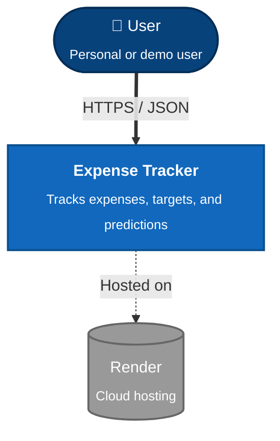

---

**Level 2 — Container**

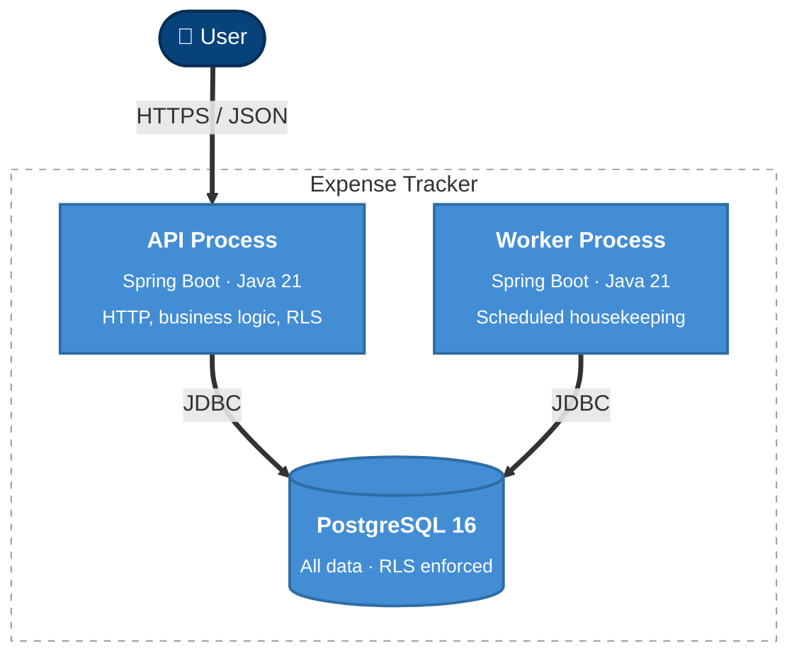

Three containers. API and Worker communicate exclusively through the database — no HTTP between them.

---

**Level 3 — API Process Components**

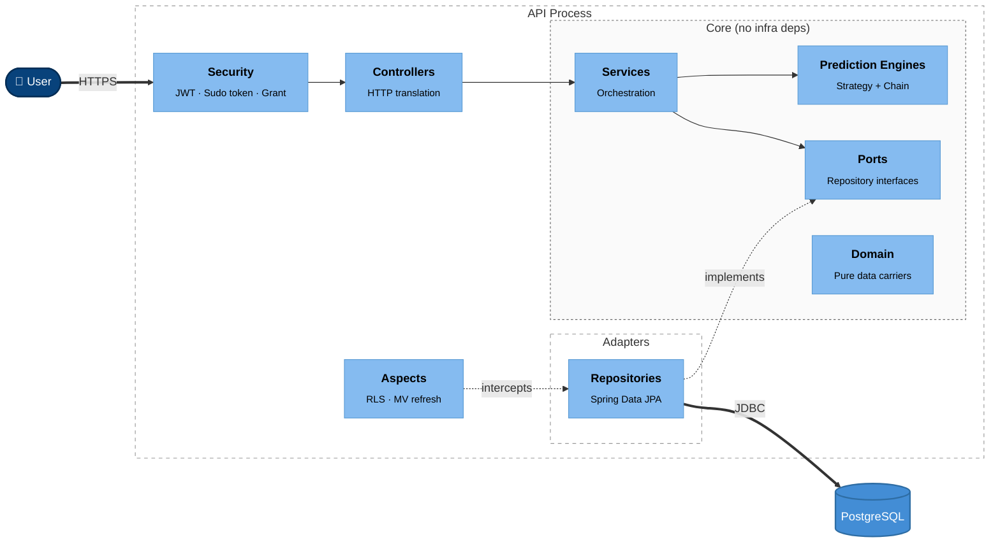

**Key Things Visible**

Security is the entry point — every request passes through it. Aspects sit outside the main flow and intercept repositories — RLS session injection and materialised view refresh. Core depends on nothing infrastructure-specific. Adapters depend on Core. Nothing depends on Adapters except Core via the implements relationship.

---

**Level 3 — Worker Process Components**

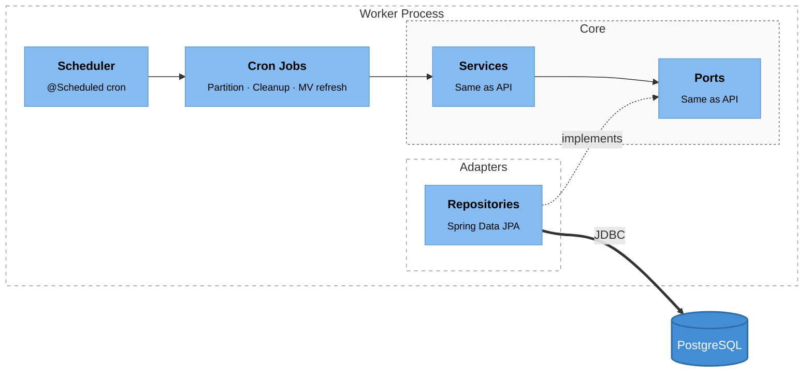

**Key Things Visible**

The Worker shares Core with the API — same services, same ports, same Repository implementations. Only the scheduler and individual job classes are Worker-specific. No HTTP server, no security filter. The Worker is headless.