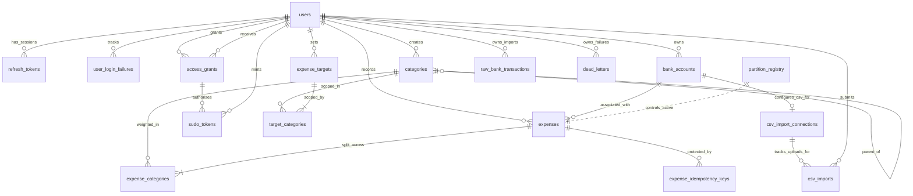

# Data Model

> **Context:** Expands [overview.md §5](../overview.md#5-the-data-the-system-holds). Implements: F1–F6, F14–F27, F34–F37, N1, N2, N4, N9–N18. Decisions referenced: [ADR-0002](../decisions/0002-postgres-for-rls-skip-locked-mvs.md), [ADR-0003](../decisions/0003-soft-delete-only.md), [ADR-0004](../decisions/0004-composite-pk-partitioned-expenses.md), [ADR-0005](../decisions/0005-server-computed-category-weights.md), [ADR-0012](../decisions/0012-system-categories-via-null-user-id.md), [ADR-0013](../decisions/0013-yearly-expense-partitions.md), [ADR-0014](../decisions/0014-materialised-view-wrapper-for-rls.md).

Twelve tables, two materialised views, one partition registry. Schema is grouped by business category.

---

## Cross-cutting conventions

These apply to every table without restatement.

**Primary keys.** All application-generated UUIDs. Avoids sequential ID enumeration attacks and works correctly across distributed systems.

**Money.** All `NUMERIC(12,2)`. Never floating point — floating point arithmetic on money is a correctness bug.

**Timestamps.** All `TIMESTAMPTZ` stored in UTC. Display conversion is the client's responsibility.

**Audit columns.** Every user-scoped business table has `created_at`, `updated_at`, `created_by`, `modified_by`. The `_at` columns are managed by DB defaults + triggers; the `_by` columns are managed by the `set_audit_user` trigger added in V23. Security / system-infrastructure tables (`user_login_failures`, `refresh_tokens`, `expense_idempotency_keys`, `partition_registry`, `job_execution_state`) skip the `_by` columns — see [ADR-0017](../decisions/0017-row-level-audit-trail.md) for which tables and why.

**Timestamp ownership rule:**

- `created_at` — set by `DEFAULT NOW()` on insert. A DB trigger (`lock_created_at`) prevents any update. Hibernate maps it with `updatable = false` as a second layer of defence.
- `updated_at` — set by `DEFAULT NOW()` on insert. A DB trigger (`set_updated_at`) overwrites it on every update automatically. Hibernate maps it with `insertable = false, updatable = false` — Java never touches this field. Accurate even if someone bypasses the application and runs SQL directly.

**User-ownership rule:**

- `created_by` — set on INSERT by the `set_audit_user` trigger to `current_setting('app.acting_user_id')` if delegation is active, else `current_setting('app.current_user_id')`, else NULL (pre-auth setup-pool writes). A separate `lock_created_by` trigger prevents updates.
- `modified_by` — set on INSERT to the same value as `created_by`. On UPDATE, refreshed to the current actor; if no actor is in scope, the previous `modified_by` is preserved (guards future scheduled jobs from erasing audit history).

**Soft deletes.** `deleted_at TIMESTAMPTZ NULL`. NULL means active. Physical deletion never happens. See [ADR-0003](../decisions/0003-soft-delete-only.md).

**Row Level Security.** RLS enabled on every tenant-scoped table. Every query is rewritten by PostgreSQL to add `WHERE user_id = current_setting('app.current_user_id')::uuid`. RESTRICTIVE mode — if the session variable is missing, queries return zero rows.

---

## Auth module

### `users`

The root identity record. Kept intentionally minimal — only what auth needs.

```
id                  UUID            PRIMARY KEY
username            VARCHAR(50)     NOT NULL UNIQUE          (3–50 chars enforced)
email               VARCHAR(255)    NOT NULL UNIQUE          (format check constraint)
password            VARCHAR(255)    NOT NULL                 (BCrypt hash, never plaintext)
is_discoverable     BOOLEAN         NOT NULL DEFAULT FALSE   (opt-in for being granted access)
locked_until        TIMESTAMPTZ     NULL                     (set when 5 failures within 10min hit, cleared on success or expiry)
```

Maps to F1, F2, F4, F5, F6, F8, N4, N13.

### `user_login_failures`

Records every failed login attempt. The sliding-window count over the last 10 minutes drives the 15-minute lockout written to `users.locked_until`. Rows are retained for 30 days for forensic value and purged by the nightly cleanup job.

```
id              UUID         PRIMARY KEY DEFAULT gen_random_uuid()
user_id         UUID         NOT NULL REFERENCES users(id) ON DELETE CASCADE
attempted_at    TIMESTAMPTZ  NOT NULL DEFAULT NOW()
ip_address      INET         NULL                              (reserved; not populated in v1.1)
```

Indexes:
- `idx_user_login_failures_user_at` on `(user_id, attempted_at DESC)` — supports the sliding-window `COUNT(*)` and the cleanup scan.

Maps to F4.

### `revoked_tokens` (removed in V22)

v1.0's per-request JWT revocation table. Replaced by `refresh_tokens` + 15-minute access tokens in S4. See [ADR-0009](../decisions/0009-jwt-revocation-via-jti-table.md) (superseded) for the v1.0 design and reasoning for removal.

### `refresh_tokens`

Stores one row per refresh token issuance. The same row is both the "this token was issued" record and (once `revoked_at` / `revoke_reason` are populated) the revocation record. Strict append-only semantics: only `revoked_at` and `revoke_reason` may transition, and only NULL → set once. Enforced by DB triggers `enforce_immutability_except` and `enforce_set_once_column` (both defined in V21 and reusable on future tables).

```
token_hash         VARCHAR(64) PRIMARY KEY                       (SHA-256 hex of the raw token)
user_id            UUID        NOT NULL REFERENCES users(id) ON DELETE CASCADE
session_started_at TIMESTAMPTZ NOT NULL                          (max-session anchor — copied unchanged across rotations)
expires_at         TIMESTAMPTZ NOT NULL                          (= session_started_at + 7 days; rotation does not extend)
issued_at          TIMESTAMPTZ NOT NULL DEFAULT NOW()
rotated_from       VARCHAR(64) NULL REFERENCES refresh_tokens(token_hash)  (chain link to predecessor)
revoked_at         TIMESTAMPTZ NULL                              (set once, never unset)
revoke_reason      VARCHAR(20) NULL                              (CHECK: ROTATED | LOGOUT | REUSE_DETECTED — set with revoked_at)
```

Indexes:
- `idx_refresh_tokens_user_active` — partial on `(user_id)` `WHERE revoked_at IS NULL`; used by chain-revocation lookups on reuse detection
- `idx_refresh_tokens_expires_at` — used by the nightly cleanup job

**RLS.** Standard RESTRICTIVE policy keyed on `user_id = current_setting('app.current_user_id')::uuid`. The `/refresh` endpoint sets `app.current_user_id` from the user_id stored on the refresh-token row before issuing the rotation.

**Lifecycle.** Login creates the first row (`rotated_from = NULL`). Each `/refresh` request marks the presented row as revoked with `revoke_reason = ROTATED` and inserts a new row with `rotated_from = <previous hash>` and the same `session_started_at` (so `expires_at` cannot extend past the original login + 7 days). Logout sets `revoke_reason = LOGOUT`. Presenting a token whose `revoked_at IS NOT NULL` triggers reuse detection: every active row for that `user_id` is revoked with `revoke_reason = REUSE_DETECTED`, forcing full re-authentication.

**Why hash-only storage.** Refresh tokens are 256-bit random values — same reasoning as `sudo_tokens` below. SHA-256 hex (64 chars) at rest; raw token never persisted. Compromise of this table reveals identifiers, not valid tokens.

Maps to F3, F36, N5.

### `access_grants`

Records that user A has granted user B the ability to act on A's data via the delegation mechanism (D1, V24). D2 (sudo tokens) and D3 (gateway filter) are required for grants to actually do anything at runtime — until they ship, grants exist as records but cannot be used.

```
id            UUID        PRIMARY KEY
grantor_id    UUID        NOT NULL REFERENCES users(id)
grantee_id    UUID        NOT NULL REFERENCES users(id)
access_level  VARCHAR(20) NOT NULL                        (CHECK in: READ_WRITE — v2.0 single level; future migrations add READ_ONLY etc.)
expires_at    TIMESTAMPTZ NOT NULL                        (NOW() + expiresInDays, bounded 1-30 at the service layer)
revoked_at    TIMESTAMPTZ NULL                            (soft revoke; grants are never physically deleted)
```

Plus the standard four audit columns (`created_at`, `updated_at`, `created_by`, `modified_by`).

**Constraints:**
- `chk_no_self_grant` — `grantor_id <> grantee_id`. DB-enforced; service layer rejects earlier with a friendlier error.
- `chk_expires_in_future` — `expires_at > created_at`. Backstop against clock skew at insert.

**RLS policy — dual-clause.** Unlike every other tenant-scoped table, `access_grants` has two user references. The policy matches if the current user is *either* role:

```sql
USING (grantor_id = current_setting('app.current_user_id')::uuid
    OR grantee_id = current_setting('app.current_user_id')::uuid)
```

This is what lets the grantee list grants given *to* them. The USING clause also acts as `WITH CHECK` on INSERT, bounding creates to grants where the current user is party.

**Indexes:**
- `idx_access_grants_grantor_active` — partial on `(grantor_id) WHERE revoked_at IS NULL`. Used by "my active grants given."
- `idx_access_grants_grantee_active` — partial on `(grantee_id) WHERE revoked_at IS NULL`. Used by "my active grants received."
- `idx_access_grants_expires_at` — used by the cleanup cron (added with D2/D3 cleanup work).

Maps to F7, F8, F9.

### `sudo_tokens`

Step-up authentication artefact for delegation. The grantee mints a sudo token by re-entering their password; the token is short-lived (15 min) and must accompany every `?asUserId=<grantor>` request handled by D3's gateway filter.

```
token_hash    VARCHAR(64)  PRIMARY KEY                       (SHA-256 hex of the raw token)
grant_id      UUID         NOT NULL REFERENCES access_grants(id)
grantee_id    UUID         NOT NULL REFERENCES users(id)     (denormalised — drives the RLS policy)
expires_at    TIMESTAMPTZ  NOT NULL
created_at    TIMESTAMPTZ  NOT NULL DEFAULT NOW()
```

**Schema notes:**
- Each sudo token is tied to a specific D1 grant via `grant_id`. The grant's current state (revoked/expired) is checked via JOIN at verify time — so revoking a grant immediately renders all its sudo tokens unusable, no cascade UPDATE needed.
- `grantee_id` is denormalised from the grant to keep the RLS policy single-clause. Without it, RLS would need a subquery into `access_grants` for every row.
- No audit columns (security primitive, not business data — same exclusion as `refresh_tokens`).
- No `revoked_at`. Sudo tokens are 15 minutes long; revocation is by time, not event. If explicit revocation is ever required, a column can be added later.

**Lifecycle.** Server generates a cryptographically secure random 32-byte token, computes SHA-256 hex, stores the hash with `grant_id`, `grantee_id`, and `expires_at = NOW() + 15 minutes`. Returns the raw token to the client **once**. On every delegation request, D3's gateway filter hashes the incoming token, looks it up, JOINs `access_grants` to confirm the underlying grant is still valid, and sets `app.current_user_id = grantor` plus `app.acting_user_id = grantee` for the request scope (the S5 forward-compat hook).

**RLS:** `USING (grantee_id = current_setting('app.current_user_id')::uuid)`. Only the grantee can see their tokens. The grantor doesn't need visibility.

**Why SHA-256 not BCrypt.** Same as `refresh_tokens`: 256-bit random values make brute force computationally infeasible. BCrypt would add latency to every delegation request for no security benefit.

Maps to F7, F11, N10.

---

## Reference data

### `banks` *(deferred — not in v2.0)*

The v1.0 design described a `banks` reference table (id / name / abn) that would back a foreign key on `bank_accounts`. **Neither the table nor the FK were ever created** — V3 ships `bank_accounts` without `bank_id`. The bank-identity concept now lives instead on `csv_import_connections.source_format` (which encodes both the bank and the CSV version, e.g. `csv_cba_v1`), so v2.0 doesn't need a separate `banks` table. If a future v3.0 aggregator path needs a real banks reference (e.g. Basiq's institution-id mapping), it can be added then with concrete requirements.

### `bank_accounts`

```
id              UUID        PRIMARY KEY
user_id         UUID        NOT NULL REFERENCES users(id)
name            VARCHAR(50) NOT NULL                          (UNIQUE per user)
account_type    VARCHAR(20) NOT NULL                          (CHECK IN ('CASH', 'CRYPTO', 'BANK', 'CREDIT_CARD'))
is_system       BOOLEAN     NOT NULL DEFAULT FALSE
```

Plus the standard four audit columns (`created_at`, `updated_at`, `created_by`, `modified_by`).

RLS enforced via `user_id`. CASH and CRYPTO system accounts are created at registration for every user (application code). BANK and CREDIT_CARD accounts are user-created (manual) in v2.0; CREDIT_CARD distinguishes credit-card-based accounts so the B3 normaliser knows to filter out card-payment rows (which are transfers, not expenses). The column was widened from VARCHAR(10) to VARCHAR(20) in V28 to fit `CREDIT_CARD` (11 chars) with headroom for future values (OFFSET, INVESTMENT, etc.) without further migrations.

Maps to F20, N10.

---

## Bank integration (v2.0)

### `raw_bank_transactions`

Append-only verbatim record of every bank transaction imported into the system (V26, B1). Captured before any normalisation so we always have ground truth to re-derive expenses from if the B3 normalisation logic changes. v2.0 populates this table from user-uploaded CSV files (one of six bank-specific formats); v3.0 may add aggregator-pulled sources alongside. Maps to N7.

```
id                      UUID         PRIMARY KEY
user_id                 UUID         NOT NULL REFERENCES users(id) ON DELETE CASCADE
source_format           VARCHAR(20)  NOT NULL                            (CHECK: csv_cba_v1 | csv_anz_v1 | csv_ubank_v1 | csv_amp_v1 | csv_qudos_v1 | csv_suncorp_v1)
external_transaction_id VARCHAR(100) NOT NULL                            (for CSV: SHA-256 of date+amount+description+bank for idempotent re-uploads)
raw_payload             JSONB        NOT NULL                            (structured parsed view + verbatim raw line)
fetched_at              TIMESTAMPTZ  NOT NULL DEFAULT NOW()
prev_hash               CHAR(64)     NULL                                (predecessor's current_hash, NULL on user's first row)
current_hash            CHAR(64)     NOT NULL                            (SHA-256 hex; set by BEFORE INSERT trigger)
UNIQUE (user_id, external_transaction_id)
UNIQUE (current_hash)
```

**`source_format` discriminator.** The CHECK constraint enforces an allow-list — typo at import time can't poison the B3 normaliser. Adding a new bank format (or v3.0 aggregator format) requires a follow-up migration that drops + recreates the constraint with the new value included. The B3 normaliser dispatches on this column to pick the right parser.

**Tamper evidence — per-user hash chain.** Each row's `current_hash = SHA-256(prev_hash || raw_payload::text || user_id || external_transaction_id)`, hex-encoded. The chain is per-user so different users don't serialise on a shared tail row and one user's compromise doesn't require recomputing everyone's chain. The `compute_raw_bank_transaction_hash` BEFORE INSERT trigger takes a `pg_advisory_xact_lock(hashtextextended(user_id::text, 0))` to serialise concurrent inserts for the same user without forcing the whole transaction into SERIALIZABLE — see [ADR-0019](../decisions/0019-basiq-credential-model.md) and the V26 comment for the rejected alternatives.

**Append-only.** UPDATE is blocked by `enforce_immutability_except()` (empty allow-list — every column locked once written); DELETE is blocked by `block_delete_on_raw_bank_transactions()`. Tamper evidence is meaningless without these.

**RLS.** Standard single-clause on `user_id`. Worker bypass-RLS reads cross-user for maintenance.

**Idempotency.** Re-syncing returns the same external_transaction_id; the unique `(user_id, external_transaction_id)` lets the application use ON CONFLICT DO NOTHING to skip duplicates without modifying the chain.

Maps to N6, N7, F20.

### `dead_letters`

Operator-surfaced record of failed background work (V27, B1). Pulled forward from B7's spec because B1's sync endpoint needs somewhere to record fetch/persist failures from day one. B7 ships the operator API on top of this table; B1 ships the table and writes to it.

```
id            UUID         PRIMARY KEY
user_id       UUID         NOT NULL REFERENCES users(id) ON DELETE CASCADE
job_type      VARCHAR(50)  NOT NULL                                      (CHECK IN: BANK_SYNC; B3 will add NORMALISE)
payload       JSONB        NOT NULL                                      (inputs needed to replay the failed work)
error_class   VARCHAR(255) NOT NULL                                      (fully-qualified exception name)
error_message TEXT         NOT NULL
attempts      INT          NOT NULL DEFAULT 1 CHECK (attempts > 0)
created_at    TIMESTAMPTZ  NOT NULL DEFAULT NOW()
retried_at    TIMESTAMPTZ  NULL                                          (set when operator hits retry, success or not)
resolved_at   TIMESTAMPTZ  NULL                                          (set when operator marks done; set-once)
```

**Mutability rules.** `enforce_immutability_except('attempts', 'retried_at', 'resolved_at')` blocks any other column from changing post-insert; the original failure record is preserved verbatim. `resolved_at` is set-once via `enforce_set_once_column` so an operator can't silently un-resolve a row. DELETE is blocked — operators "delete" by resolving via the API.

**RLS.** Per-user isolation on `user_id`. The B1 sync endpoint runs on the app pool, so writes happen under `app.current_user_id = the syncing user`. B7's operator API for cross-user dashboards (if added) would need the superuser pool or a deliberate RLS exception — not in scope for v2.0.

**`job_type` discriminator.** CHECK constraint enforces an allow-list (`BANK_SYNC` in v2.0; B3 adds `NORMALISE` via a follow-up migration). Each writer + retry handler shares the schema contract for its job_type's `payload` shape.

Maps to N7, N21.

### `csv_import_connections`

Per-account CSV import configuration (V28, B1.3). One row per `bank_account` that has CSV import set up. The bank-integration module owns this table exclusively — nothing outside `com.finance.bankintegration..` reads or writes it (ArchUnit-enforced in B1.4). v3.0 may add a sibling `basiq_import_connections` (or similar) for aggregator-pulled accounts; the cross-source "at most one active per bank_account" invariant arrives in v3.0 with the second source — not needed while only CSV exists.

```
bank_account_id  UUID         PRIMARY KEY REFERENCES bank_accounts(id) ON DELETE CASCADE
user_id          UUID         NOT NULL REFERENCES users(id)                                (denormalised for RLS)
bank_id          VARCHAR(20)  NOT NULL                                                     (CHECK: cba | anz | ubank | amp | qudos | suncorp)
csv_export_url   VARCHAR(500) NULL                                                         (user's bookmark for the bank's CSV export page)
last_imported_at TIMESTAMPTZ  NULL                                                         (set on successful import only; drives 7-day rate limit)
last_date_to     DATE         NULL                                                         (MAX(transaction_date) ever seen; UX hint, not a rate-limit input)
```

Plus the standard four audit columns.

**1:1 with `bank_accounts`.** The PK is the FK to `bank_accounts.id` — at most one CSV connection per account. Switching off CSV is a delete-row operation. Cascade delete ensures orphan-free.

**`bank_id` discriminator.** The CHECK list enforces the supported-banks allow-list. New banks add a value here and to `raw_bank_transactions.source_format`'s CHECK in a single migration. *Note*: the column is named `bank_id` (rather than `bank_code`) for consistency with the schema's `*_id` convention even though there's no `banks` table — values are an enum encoded as VARCHAR. See [ADR-0020](../decisions/0020-csv-import-architecture.md) for the date-dispatched parser model that makes this column persistent across format-revision changes.

**Parser version dispatch (date-based).** Unlike a stored `source_format` design, this connection doesn't lock in a parser version. The import service picks the parser at upload time using `(bank_id, exportedOnDate)`. When a bank changes their export format, we ship a new parser version (e.g. `csv_cba_v2`) with a `validFromDate`; existing connections keep working with the old parser for older exports and the new parser for newer ones. The parser stamps its own `versionTag` into `raw_bank_transactions.source_format` on each persisted row, so per-row provenance is preserved.

**Rate limit.** `last_imported_at` is updated by the import service on success only. The service checks `NOW() < last_imported_at + INTERVAL '7 days'` and returns 429 if true. Failed imports don't reset the timer.

**RLS.** Standard single-clause on `user_id`.

Maps to N6, N7.

### `csv_imports`

Job state for async CSV processing (V29, B1.4). Each row tracks one upload from submission through to terminal status. The upload endpoint inserts a `PENDING` row, hands the bytes to a Spring `@Async` processor, and returns 202 immediately; the processor walks the row through `RUNNING` → `COMPLETED` (or `FAILED`) over batches.

```
id                       UUID         PRIMARY KEY
bank_account_id          UUID         NOT NULL REFERENCES csv_import_connections(bank_account_id) ON DELETE CASCADE
user_id                  UUID         NOT NULL REFERENCES users(id)                      (denormalised for RLS)
status                   VARCHAR(20)  NOT NULL                                            (PENDING | RUNNING | COMPLETED | FAILED)
exported_on_date         DATE         NOT NULL                                            (drives parser dispatch)
parser_version_tag       VARCHAR(20)  NOT NULL                                            (matches the parser the dispatcher picked)
raw_csv_bytes            BYTEA        NOT NULL                                            (zeroed when terminal — see raw_csv_bytes_deleted_at)
raw_csv_bytes_deleted_at TIMESTAMPTZ  NULL
imported_count           INT          NOT NULL DEFAULT 0
deduped_count            INT          NOT NULL DEFAULT 0
parse_error_count        INT          NOT NULL DEFAULT 0
last_processed_row       INT          NOT NULL DEFAULT 0
error_message            TEXT         NULL                                                (populated only when status=FAILED)
submitted_at             TIMESTAMPTZ  NOT NULL DEFAULT NOW()
started_at               TIMESTAMPTZ  NULL                                                (set when status -> RUNNING)
completed_at             TIMESTAMPTZ  NULL                                                (set on COMPLETED or FAILED)
```

Plus the standard four audit columns. State-machine integrity is backstopped by CHECK constraints (`chk_terminal_has_completed_at`, `chk_non_pending_has_started_at`, `chk_failed_has_error`, `chk_bytes_deleted_only_on_terminal`).

**State transitions:**
- `PENDING → RUNNING` — processor picks it up, sets `started_at`.
- `RUNNING → COMPLETED` — final batch persists, bytes zeroed, `csv_import_connections.last_imported_at` / `last_date_to` updated in the same transaction.
- `RUNNING → FAILED` — terminal exception caught; `error_message` set, `completed_at` set, bytes zeroed. Connection's `last_*` left unchanged so the rate-limit door stays open.
- `RUNNING → PENDING` — startup recovery resets rows whose API process died mid-import (`started_at < NOW() - 10 min`). Counters reset to 0; the processor restarts from the beginning (dedup catches partial inserts from the previous run).

**Why `raw_csv_bytes` lives here.** The async boundary means the upload request is gone by the time the processor runs. The bytes have to live somewhere durable. Putting them on the same row that tracks job state keeps everything in one place; immediate cleanup on terminal status bounds growth (`UPDATE csv_imports SET raw_csv_bytes = '\\x', raw_csv_bytes_deleted_at = NOW() WHERE id = ?` in the same TX that flips to COMPLETED).

**Rate-limit semantics.** On upload, the service rejects (429) if any row exists for this `bank_account_id` with `status IN ('RUNNING')` OR `(status = 'COMPLETED' AND completed_at > NOW() - INTERVAL '7 days')`. The partial index `idx_csv_imports_recent_per_connection` keeps that check fast.

**Schema-level defence-in-depth (V30).** A partial UNIQUE index `idx_csv_imports_one_in_flight_per_account` on `(bank_account_id) WHERE status IN ('PENDING','RUNNING')` enforces "at most one in-flight import per bank account" at the DB layer. The app-layer rate-limit check is racy — two concurrent uploads can both pass `hasRecentOrInFlightImport` in the same millisecond — and this index closes that race. The service catches the resulting `DataIntegrityViolationException` and re-throws as `CsvImportRateLimitedException`, surfacing the same 429 response. The 7-day COMPLETED cooldown can't move to the index because Postgres forbids non-immutable functions like `NOW()` in partial-index predicates.

**RLS** standard on `user_id`. **Setup-pool grant** — the startup recovery scan runs outside any user context (no JWT at process start), so it goes through the setup pool, which bypasses RLS (BYPASSRLS via `expense_setup` in the v2.0 design; owner-bypass under the Option-A pivot — see [ADR-0011](../decisions/0011-three-layer-rls-defence.md)). V29 grants `SELECT, UPDATE` on this table to `expense_setup` to document intent; recovery resets stale RUNNING rows + re-kicks-off the `@Async` processor.

Maps to N6, N7, N21.

### `categories`

```
id           UUID         PRIMARY KEY
user_id      UUID         NULL REFERENCES users(id)
name         VARCHAR(50)  NOT NULL
description  VARCHAR(255) NULL
parent_id    UUID         NULL REFERENCES categories(id)
```

`user_id IS NULL` means a system category. `user_id NOT NULL` means a private user category. No separate `is_system` column — it would be redundant and risks inconsistency. See [ADR-0012](../decisions/0012-system-categories-via-null-user-id.md).

**RLS policy:**
```sql
CREATE POLICY category_isolation ON categories
USING (user_id IS NULL
    OR user_id = current_setting('app.current_user_id')::uuid);
```

**Uniqueness — partial indexes:**
```sql
CREATE UNIQUE INDEX uq_system_category_name
ON categories (name)
WHERE user_id IS NULL;

CREATE UNIQUE INDEX uq_user_category_name
ON categories (user_id, name)
WHERE user_id IS NOT NULL;
```

System-wide names are unique. User-scoped names are unique per user. User A and User B can both have a "PETROL" — they do not conflict with each other or with the system version.

System category descriptions follow the format `"System generated - <NAME>"`. Set in the Flyway seed script.

**Parent-Child rule.** System categories cannot have user categories as parents (would expose private data via the hierarchy). The reverse is allowed. Enforced by application-layer validation in v1.0.

**Population in v1.0.** Flyway seeds useful system categories at DB startup — UNCATEGORISED, GROCERIES, DINING, TRANSPORT, UTILITIES, RENT, ENTERTAINMENT, HEALTHCARE. Users create their own categories via the existing `POST /api/v1/categories` endpoint. No promotion mechanism in v1.0.

Maps to F14, F15, F17, F19, N10, N14.

### `expenses`

```sql
CREATE TABLE expenses (
    id              UUID        NOT NULL,
    user_id         UUID        NOT NULL REFERENCES users(id),
    amount          NUMERIC(12,2) NOT NULL CHECK (amount > 0),
    merchant_name   VARCHAR(255) NOT NULL,
    expense_date    DATE        NOT NULL CHECK (expense_date <= CURRENT_DATE),
    payment_method  VARCHAR(20) NOT NULL CHECK (payment_method IN
                      ('CASH', 'CREDIT_CARD', 'DEBIT_CARD', 'BANK_TRANSFER', 'OTHER')),
    bank_account_id UUID        NOT NULL REFERENCES bank_accounts(id),
    notes           TEXT        NULL,
    source          VARCHAR(20) NOT NULL DEFAULT 'MANUAL'
                      CHECK (source IN ('MANUAL', 'BANK_IMPORT')),
    deleted_at      TIMESTAMPTZ NULL,
    PRIMARY KEY (id, expense_date)
) PARTITION BY RANGE (expense_date);
```

**Partitioning.** Yearly partitions. The `partition_registry` table tracks which years exist and their status. The worker creates next year's partition every December and archives the oldest year every January. Active partitions cover 5 years. See [ADR-0013](../decisions/0013-yearly-expense-partitions.md).

**Composite primary key.** `(id, expense_date)` — required by PostgreSQL when partitioning on `expense_date`. This is why single-expense lookups require both `id` and `date` as parameters in the API. See [ADR-0004](../decisions/0004-composite-pk-partitioned-expenses.md).

**Deferred to v2.0.** `fingerprint` for soft deduplication, `external_transaction_id` for Basiq, `bank_status` for pending vs settled, `merged_from` for duplicate-resolution audit, `ai_categorised` for AI categorisation. Added via migration when needed.

Maps to F20, F21, F22, F23, F24, F26, N9, N10, N11, N12.

### `expense_categories`

```sql
CREATE TABLE expense_categories (
    expense_id      UUID          NOT NULL,
    expense_date    DATE          NOT NULL,
    category_id     UUID          NOT NULL REFERENCES categories(id),
    user_id         UUID          NOT NULL REFERENCES users(id),
    weight_amount   NUMERIC(12,2) NOT NULL CHECK (weight_amount > 0),
    PRIMARY KEY (expense_id, expense_date, category_id),
    FOREIGN KEY (expense_id, expense_date) REFERENCES expenses(id, expense_date)
);
```

`expense_id` and `expense_date` together reference the parent expense — the composite FK is required because the expenses table primary key is composite due to partitioning.

`user_id` denormalised from the expense for RLS efficiency. Safe to denormalise because expense ownership never changes after creation.

`weight_amount` stores the pre-computed even split at write time. A $100 expense across 4 categories stores 4 rows with $25 each. Eliminates recomputation on every aggregation query. See [ADR-0005](../decisions/0005-server-computed-category-weights.md).

Maps to F19, F20, F26, N10.

### `expense_idempotency_keys`

```sql
CREATE TABLE expense_idempotency_keys (
    user_id          UUID         NOT NULL REFERENCES users(id),
    idempotency_key  VARCHAR(255) NOT NULL,
    expense_id       UUID         NOT NULL,
    expense_date     DATE         NOT NULL,
    expires_at       TIMESTAMPTZ  NOT NULL DEFAULT (NOW() + INTERVAL '24 hours'),
    PRIMARY KEY (user_id, idempotency_key),
    FOREIGN KEY (expense_id, expense_date) REFERENCES expenses(id, expense_date)
);
```

The composite PK `(user_id, idempotency_key)` scopes keys per user — the same client-generated UUID from two different users does not conflict.

`expense_id` + `expense_date` link to the original expense so the server can return it on a duplicate request rather than rejecting.

`expires_at` defaults to 24 hours — standard industry retry window. Cleanup job removes expired rows nightly. Idempotency keys are not credentials — storing in plaintext is fine.

Maps to F27, F36, N10.

---

## Target module

### `expense_targets`

```sql
CREATE TABLE expense_targets (
    id           UUID          PRIMARY KEY,
    user_id      UUID          NOT NULL REFERENCES users(id),
    target_type  VARCHAR(20)   NOT NULL CHECK (target_type IN ('CATEGORY', 'MULTI_CATEGORY', 'TOTAL')),
    amount       NUMERIC(12,2) NOT NULL CHECK (amount > 0),
    period_year  INTEGER       NOT NULL,
    period_month INTEGER       NOT NULL CHECK (period_month BETWEEN 1 AND 12),
    deleted_at   TIMESTAMPTZ   NULL
);
```

Soft delete only — historical target data is retained for future trend analysis.

`period_year` and `period_month` as separate fields match the API contract and are easier to query than parsing a date.

Maps to F28, F30, F31, N10, N15.

### `target_categories`

```sql
CREATE TABLE target_categories (
    target_id           UUID         NOT NULL REFERENCES expense_targets(id),
    category_id         UUID         NOT NULL REFERENCES categories(id),
    user_id             UUID         NOT NULL REFERENCES users(id),
    participation_type  VARCHAR(20)  NOT NULL DEFAULT 'INCLUSIVE'
                          CHECK (participation_type IN ('INCLUSIVE', 'EXCLUSIVE')),
    PRIMARY KEY (target_id, category_id)
);
```

**Why split into two tables.** A target has one amount and one period. Its scope can span one or many categories with inclusive or exclusive participation. Separating scope into a junction handles all three target types — `CATEGORY`, `MULTI_CATEGORY`, `TOTAL` — through one unified mechanism.

- `CATEGORY` target → one junction row with `INCLUSIVE`
- `MULTI_CATEGORY` target → multiple `INCLUSIVE` rows
- `TOTAL` target → zero or more `EXCLUSIVE` rows

The application enforces which combinations are valid per type.

**Uniqueness for active target per period and scope.** Deferred to application layer in v1.0. Two active targets for the same scope and period are technically allowed by the schema but the application prevents creation. Adequate at this scale.

Maps to F28, F29, F30, F31, N10, N15.

---

## Worker state

### `job_execution_state`

Tracks scheduled-job runs so retry state survives a worker restart and the alerter can detect crashed ticks on the next firing. One row per job name. Written by `JobFailureAlerter` in a `REQUIRES_NEW` transaction so the row commits even when the wrapped job's transaction rolls back.

```sql
CREATE TABLE job_execution_state (
    job_name       TEXT        PRIMARY KEY,
    status         TEXT        NOT NULL CHECK (status IN ('RUNNING', 'SUCCESS', 'ALERTED')),
    attempt_count  INT         NOT NULL DEFAULT 0,
    last_error     TEXT,
    created_at     TIMESTAMPTZ NOT NULL DEFAULT NOW(),
    updated_at     TIMESTAMPTZ NOT NULL DEFAULT NOW()
);
```

System-wide infrastructure shared across all jobs — no RLS. The CHECK constraint mirrors the `JobExecutionStatus` enum in `worker/.../alert/JobExecutionStatus.java`; adding a new status requires both an enum value and a migration that drops and recreates the constraint.

**Lifecycle per tick:**
1. Tick fires → row upserted with `status = RUNNING`, `attempt_count = 0`.
2. Each retry updates `attempt_count`; on success → `status = SUCCESS`.
3. After all five attempts fail → `status = ALERTED`, `last_error` set, email sent.
4. **Crash recovery:** if the next tick sees `status = RUNNING` and `updated_at < NOW() - 15 minutes`, it resumes from `attempt_count + 1` rather than restarting.

The nightly `cleanupJobExecutionState` job (02:15 UTC) prunes `SUCCESS` rows older than 1 day and `ALERTED` rows older than 7 days. Retention bounds the table without losing recent history. Full failure semantics in [../operations/scheduled-jobs.md](../operations/scheduled-jobs.md).

---

## Partition registry

### `partition_registry`

```sql
CREATE TABLE partition_registry (
    partition_year SMALLINT     PRIMARY KEY,
    status         VARCHAR(10)  NOT NULL CHECK (status IN ('ACTIVE', 'ARCHIVED'))
);
```

System-wide infrastructure shared across all users — no RLS. All users share the same partitioning state.

**Population.** Flyway seeds the current year at first deployment and creates the corresponding PostgreSQL partition. Worker's December cron job inserts next year's row and creates the partition. Worker's January cron job updates the oldest row to `ARCHIVED`.

**Partition naming.** Deterministic — `expenses_<year>`. The worker constructs names from the year. No need to store the name as a column.

**How materialised views use it.** Views join on `partition_registry WHERE status = 'ACTIVE'` so archived partitions are excluded automatically. Changing partition status changes view results without modifying the view definition.

Maps to F34, F35, N11, N12.

---

## Materialised views

### `mv_monthly_expense_summary`

```sql
CREATE MATERIALIZED VIEW mv_monthly_expense_summary AS
SELECT
    ec.user_id,
    EXTRACT(YEAR FROM e.expense_date)::SMALLINT  AS period_year,
    EXTRACT(MONTH FROM e.expense_date)::SMALLINT AS period_month,
    ec.category_id,
    SUM(ec.weight_amount)                         AS total_amount,
    COUNT(DISTINCT e.id)                          AS transaction_count
FROM expense_categories ec
JOIN expenses e
    ON e.id = ec.expense_id
    AND e.expense_date = ec.expense_date
JOIN partition_registry pr
    ON EXTRACT(YEAR FROM e.expense_date)::SMALLINT = pr.partition_year
WHERE e.deleted_at IS NULL
  AND pr.status = 'ACTIVE'
GROUP BY ec.user_id, period_year, period_month, ec.category_id;

CREATE UNIQUE INDEX uq_mv_monthly_expense_summary
ON mv_monthly_expense_summary (user_id, period_year, period_month, category_id);

CREATE VIEW v_monthly_expense_summary AS
SELECT * FROM mv_monthly_expense_summary
WHERE user_id = current_setting('app.current_user_id')::uuid;
```

### `mv_merchant_summary`

```sql
CREATE MATERIALIZED VIEW mv_merchant_summary AS
SELECT
    e.user_id,
    EXTRACT(YEAR FROM e.expense_date)::SMALLINT  AS period_year,
    EXTRACT(MONTH FROM e.expense_date)::SMALLINT AS period_month,
    e.merchant_name,
    SUM(e.amount)                                 AS total_amount,
    COUNT(*)                                      AS transaction_count
FROM expenses e
JOIN partition_registry pr
    ON EXTRACT(YEAR FROM e.expense_date)::SMALLINT = pr.partition_year
WHERE e.deleted_at IS NULL
  AND pr.status = 'ACTIVE'
GROUP BY e.user_id, period_year, period_month, e.merchant_name;

CREATE UNIQUE INDEX uq_mv_merchant_summary
ON mv_merchant_summary (user_id, period_year, period_month, merchant_name);

CREATE VIEW v_merchant_summary AS
SELECT * FROM mv_merchant_summary
WHERE user_id = current_setting('app.current_user_id')::uuid;
```

**Why two views.** Category aggregation uses `expense_categories.weight_amount` because expenses split across categories. Merchant aggregation uses `expenses.amount` directly because each expense has one merchant. The structure of the underlying data dictates the view shape.

**Why the unique index.** `REFRESH MATERIALIZED VIEW CONCURRENTLY` requires it. Concurrent refresh does not block reads — the unique index is what makes that possible. Direct consequence of [ADR-0008](../decisions/0008-aop-materialised-view-refresh.md).

**Why the wrapper views.** PostgreSQL RLS policies do not apply to materialised views directly. The wrapper regular view applies the session-variable filter. The application always queries the wrapper (`v_`), inheriting the same RLS enforcement model used across the rest of the schema. See [ADR-0014](../decisions/0014-materialised-view-wrapper-for-rls.md).

**Joining on partition_registry.** The views only include rows from active partitions. Archived partition data is excluded automatically without changing the view definition. When a partition is archived, its data disappears from the next refresh.

Maps to F25, F31, F37, N16, N17, N18.

---

## ERD overview


